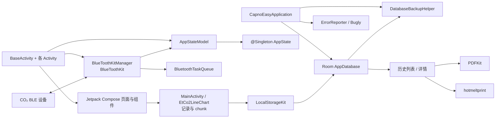
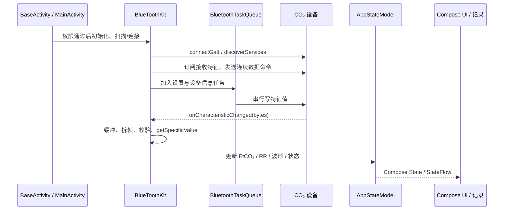

# CapnoEasy Android 架构

Android 独立架构源码基线：578c423Kotlin · Compose · Room

!!! info "证据与维护基线"
    本页直接核验提交 `578c4232e3723f635c7f3f3e25eac91889476563` 的 Android 源码；验收时后续提交未改动 `apps/android/`。源码、配置、迁移和测试始终优先于本文。

!!! abstract "先看结论"
    Android 端不是一个抽象的“跨平台分层”实例。当前实现由 `Activity + Jetpack Compose` 页面、全局 `AppState`/`AppStateModel`、多个 Kit 单例、Room 数据库、SharedPreferences、PDF 与热敏打印组成。本页记录当前代码的实际结构，不把目标架构写成已实现事实。

UI 入口<strong>Activity + Compose</strong><small>`BaseActivity` 统一页壳</small>

运行时核心<strong>AppState + Kit 单例</strong><small>Hilt 与手动全局对象并存</small>

记录与输出<strong>Room + PDF + 打印</strong><small>包含备份/恢复链路</small>

## 当前架构图

<figure class="wiki-diagram wiki-diagram--wide" markdown>

<figcaption><strong>文字摘要：</strong>Android 的主链路是 Activity/Compose ↔ 全局状态 ↔ Kit 单例，并通过 Room 把记录接到历史、PDF、打印和备份；这与 iOS 的 EnvironmentObject + 内存历史路径不同。</figcaption>
</figure>

## 启动与页面壳

1. `CapnoEasyApplication` 通过 `@HiltAndroidApp` 成为应用入口，初始化 `ErrorReporter`、Room `AppDatabase` 和 `DatabaseBackupHelper`，并跟踪 Activity 生命周期。
2. 业务页面大多继承 `BaseActivity`。`BaseActivity.onCreate()` 为当前 Activity 取得 `AppStateModel`，初始化 BLE、存储和打印管理器，然后用 `setContent` 渲染 Compose `BaseLayout`。
3. `BaseLayout` 承载页面内容、底部导航和 Toast/Alert/Confirm/Loading/ActionModal 等全局浮层。
4. `MainActivity` 负责主监护页、自动连接、记录开停、患者/报告设置和外部存储权限路径；其他 Activity 分别承载设备搜索、设置、历史和详情。

## 状态所有权

| 对象 | 当前职责 | 生命周期与边界 |
|---|---|---|
| `AppState` | 导航、浮层、患者、记录、指标、报警、设置、PDF/打印和设备列表 | `@Singleton`，是 Android 运行时的全局可变状态 |
| `AppStateModel` | 将 `AppState` 暴露为 Compose `State`/`StateFlow`，提供更新方法 | 每个 Activity 由 `ViewModelProvider` 取得，底层共享同一 `AppState` |
| `BlueToothKitManager` | 保存 `BlueToothKit` 全局实例 | 手动单例，持有 Activity 与 `AppStateModel`；可被 `reInit` 替换 |
| `LocalStorageKitManager` | 保存存储 Kit | 手动单例，连接 Application 中的 Room 实例 |

Hilt 已用于 Application、Activity、`AppState` 和 `AppStateModel`，但 BLE、存储、备份、打印仍有手动 Manager 单例。因此当前不应被描述成纯 MVVM 或完整 DI 架构。

## BLE 与实时数据链路

<figure class="wiki-diagram wiki-diagram--wide" markdown>

<figcaption><strong>文字摘要：</strong>`BlueToothKit` 同时包含 Android BLE 传输、设备协议解析、状态更新、报警音和部分经典蓝牙打印机处理；`BluetoothTaskQueue` 是 Android 特有的写入串行化机制。</figcaption>
</figure>

## Room、记录与输出

- `AppDatabase` 使用 Room version 2，实体为 `Patient`、`Record` 和 `CO2Data`，并注册 `MIGRATION_1_2`。
- `CO2Data` 以 `recordId + chunkIndex` 组织波形分块，数据由 Gson 序列化后 GZIP 压缩。
- `EtCo2LineChart` 收集 `totalCO2WavedDataFlow`，当记录存在时分块写入 Room；`LocalStorageKit.stopRecord()` 补写剩余数据。
- 设置与打印偏好使用 SharedPreferences；历史列表和详情从 Room 读取。
- `PDFKit` 生成 PDF，`hotmeltprint` 模块负责热敏打印，`DatabaseBackupHelper` 处理数据库/WAL/SHM 备份恢复。

## 架构约束与已知风险

- `AppState` 聚合了多个业务域，页面改动可能通过全局状态影响其他 Activity。
- `BlueToothKitManager` 持有 Activity，且存在延迟重新初始化，需要警惕生命周期和引用替换。
- `BlueToothKit` 承担职责过多：BLE、经典蓝牙、协议、报警、设备信息与状态发布尚未分层。
- Room 设置 `exportSchema = false`，仓库 schema 快照和 migration 测试不完整。
- 备份恢复、PDF 和打印都是 Android 自有链路，不得直接用 iOS 页面推断其行为。

## 与 iOS 共享什么

两端只共享业务与设备协议语义：BLE UUID/命令、字节序与缩放、EtCO₂/RR/报警规则、单位、记录字段和报告期望。实现结构、生命周期、存储模型和输出能力不共享。对照阅读 [iOS 架构](ios-architecture.md)。

## 可点击代码证据

- [Application 启动](https://github.com/weisiwu/Capnograph/blob/578c4232e3723f635c7f3f3e25eac91889476563/apps/android/app/src/main/java/com/wldmedical/capnoeasy/CapnoEasyApplication.kt)
- [Activity/Compose 页壳](https://github.com/weisiwu/Capnograph/blob/578c4232e3723f635c7f3f3e25eac91889476563/apps/android/app/src/main/java/com/wldmedical/capnoeasy/pages/BaseActivity.kt)
- [全局状态](https://github.com/weisiwu/Capnograph/blob/578c4232e3723f635c7f3f3e25eac91889476563/apps/android/app/src/main/java/com/wldmedical/capnoeasy/models/AppStateModel.kt)
- [Android BLE 与协议](https://github.com/weisiwu/Capnograph/blob/578c4232e3723f635c7f3f3e25eac91889476563/apps/android/app/src/main/java/com/wldmedical/capnoeasy/kits/BlueToothKit.kt)
- [Room 与存储 Kit](https://github.com/weisiwu/Capnograph/blob/578c4232e3723f635c7f3f3e25eac91889476563/apps/android/app/src/main/java/com/wldmedical/capnoeasy/kits/LocalStorageKit.kt)
- [PDF 生成](https://github.com/weisiwu/Capnograph/blob/578c4232e3723f635c7f3f3e25eac91889476563/apps/android/app/src/main/java/com/wldmedical/capnoeasy/kits/PDFKit.kt)
