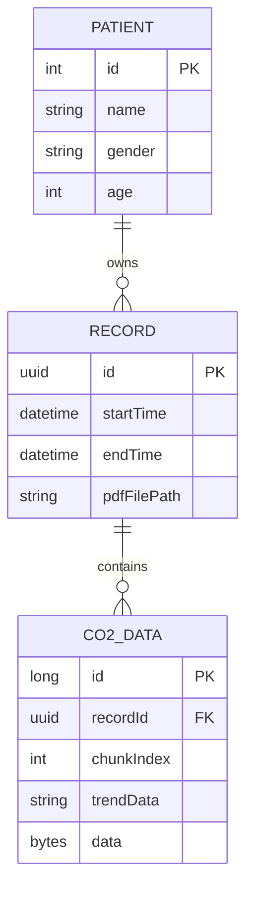
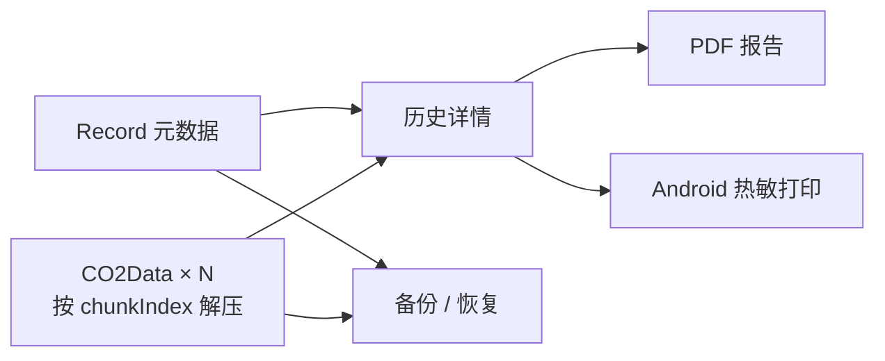

# CapnoEasy 持久化、迁移与输出

记录与 chunk迁移与恢复报告与产物

## Android 本地记录关系

<figure class="wiki-diagram" markdown>

<figcaption><strong>文字摘要：</strong>患者拥有记录，记录拥有有序波形块；`recordId + chunkIndex` 是防止跨记录和乱序的核心约束。</figcaption>
</figure>

`CO2Data.data` 是 `List<CO2WavePointData>` 的 Gson JSON 经 GZIP 压缩结果。实时路径达到 `maxRecordDataChunkSize` 后写入，成功后才从内存队列删除；停止时补写剩余点。

当前常量保留 `10000` 的注释值，但实际使用带“临时测试”标记的 `100`，`trendStep` 也为 `100`。发布前需固定生产参数，并验证 I/O、数据库增长、趋势点和旧记录兼容。

## 数据库与迁移现状

- `AppDatabase` 为 version 2，并注册 `MIGRATION_1_2`；
- `@Database(exportSchema = false)`，Gradle 却配置 `room.schemaLocation`；
- 仓库只看到 version 1 schema 快照；
- 现有测试没有证明 v1→v2、备份→恢复或损坏数据库。

“能编译”不是升级完成的证据。实体、Converter、索引或压缩格式变化都需要 schema diff、Migration 测试、旧数据样本和失败回滚说明。

## 从记录到输出

<figure class="wiki-diagram wiki-diagram--wide" markdown>

<figcaption><strong>文字摘要：</strong>历史、PDF、打印和备份必须引用同一记录快照；不能从当前 UI 或偏好拼接另一个患者的数据。</figcaption>
</figure>

新记录优先使用 `sampleTimeMillis` 重建真实时间轴；旧数据可回退到 `startTime + index / 采样率`。采样率、单位或记录时间变化不能只验证视图层。

## 输出审核重点

| 输出 | 必须一致 | 失败路径 |
|---|---|---|
| 历史详情 | 患者、记录时间、chunk 顺序、单位 | 损坏块、缺块、旧数据回退 |
| PDF | 患者字段、时间轴、参考范围、分页、文件名 | 取消导出、长记录、字体/位图失败 |
| 热敏打印 | 同一记录快照、文本与波形版本 | 断连、缺纸、部分发送、重复点击 |
| 备份恢复 | 主库/WAL/SHM、schema、外键、chunk 数 | 空间不足、损坏备份、迁移失败、回滚 |

异常状态和关闭证据见[故障路径与恢复](../review/failure-paths.md)。

## 构建与产物契约

产物必须记录版本、variant、完整提交 SHA、构建环境、哈希和签名状态。Android debug/release、iOS scheme、`scripts/package.sh` 与 Docker 入口应给出可复现结果；发布证据格式见[测试与发布证据](../review/release-evidence.md)。

## 可点击代码证据

- [Android 本地存储](https://github.com/weisiwu/Capnograph/blob/edfd024010878ede15ae0d16c58308adc8eebef7/apps/android/app/src/main/java/com/wldmedical/capnoeasy/kits/LocalStorageKit.kt)
- [实时波形与 chunk 写入](https://github.com/weisiwu/Capnograph/blob/edfd024010878ede15ae0d16c58308adc8eebef7/apps/android/app/src/main/java/com/wldmedical/capnoeasy/components/EtCo2LineChart.kt)
- [PDF 生成](https://github.com/weisiwu/Capnograph/blob/edfd024010878ede15ae0d16c58308adc8eebef7/apps/android/app/src/main/java/com/wldmedical/capnoeasy/kits/PDFKit.kt)
- [统一打包入口](https://github.com/weisiwu/Capnograph/blob/edfd024010878ede15ae0d16c58308adc8eebef7/scripts/package.sh)
