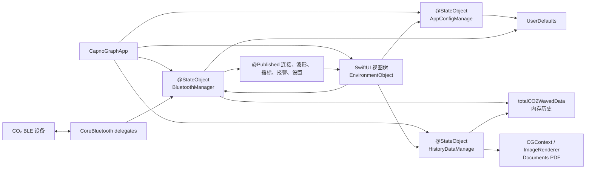
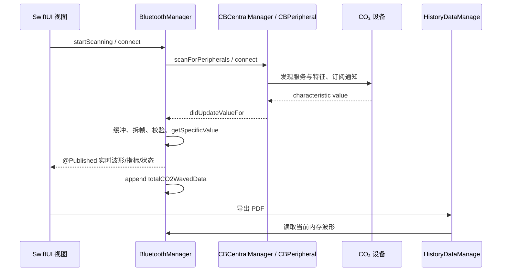

# CapnoEasy iOS 架构

iOS 独立架构源码基线：578c423SwiftUI · CoreBluetooth · PDFKit

!!! info "证据与维护基线"
    本页直接核验提交 `578c4232e3723f635c7f3f3e25eac91889476563` 的 iOS 源码；验收时后续提交未改动 `apps/ios/`。源码、配置和测试始终优先于本文。

!!! abstract "先看结论"
    iOS 端是以 SwiftUI `App` 为入口的独立实现。`CapnoGraphApp` 创建 `BluetoothManager`、`AppConfigManage` 和 `HistoryDataManage` 三个 `@StateObject`，再通过 `EnvironmentObject` 注入视图树。CoreBluetooth、协议解析、实时状态和当前波形历史集中在 `BluetoothManager`；报告从当前内存波形生成 PDF。当前源码未显示与 Android Room 历史库等价的持久化模型。

UI 入口<strong>SwiftUI App</strong><small>`StateObject` 注入视图树</small>

运行时核心<strong>ObservableObject</strong><small>`BluetoothManager` 集中管理设备与实时状态</small>

记录与输出<strong>内存波形 → PDF</strong><small>UserDefaults 保存设置</small>

## 当前架构图

<figure class="wiki-diagram wiki-diagram--wide" markdown>

<figcaption><strong>文字摘要：</strong>iOS 的主链路是 SwiftUI 视图树 ↔ EnvironmentObject ↔ CoreBluetooth/内存数据；它没有 Android 的 Activity 页壳、Kit Manager 单例和 Room 分块历史链路。</figcaption>
</figure>

## 启动与视图树

1. `CapnoGraphApp` 是 `@main` 入口，先显示 `SplashView`，结束后进入 `ContentView`。
2. App 层创建 `BluetoothManager`、`AppConfigManage`、`HistoryDataManage` 三个 `@StateObject`，并作为 `EnvironmentObject` 注入。
3. `ContentView` 进入 `BasePageView`，页面和配置视图直接读写环境对象；页面切换不是 Android 的 Activity 导航。
4. `onAppear` 把 `BluetoothManager` 引用传给 `AppConfigManage` 和 `HistoryDataManage`，因此三者之间不是严格的单向依赖。

## 状态所有权

| 对象 | 当前职责 | 生命周期与边界 |
|---|---|---|
| `BluetoothManager` | CoreBluetooth、协议收发/解析、连接状态、EtCO₂/RR/波形、报警、设备配置、音频、当前内存波形 | App 级 `@StateObject`，同时是 `CBCentralManagerDelegate` 和 `CBPeripheralDelegate` |
| `AppConfigManage` | 中英文文案、设备信息投影、Loading/Toast/Alert 配置 | App 级 `@StateObject`，可持有 `BluetoothManager` 引用 |
| `HistoryDataManage` | 建立当前记录快照、分页渲染波形、生成并暴露 PDF URL | App 级 `@StateObject`，输入直接来自 `BluetoothManager.totalCO2WavedData` |
| `UserDefaults` | 报警范围、窒息时间、氧气补偿、CO₂ 单位/量程、上次连接设备 ID | 设置型持久化，不是历史记录数据库 |

## CoreBluetooth 与实时数据链路

<figure class="wiki-diagram wiki-diagram--wide" markdown>

<figcaption><strong>文字摘要：</strong>iOS 没有 Android `BluetoothTaskQueue` 对应的独立队列类；多条设置命令在 `BluetoothManager` 中直接通过 `CBPeripheral.writeValue` 发送。</figcaption>
</figure>

## 记录、设置与 PDF

- 每个解析后的 `CO2WavePointData` 追加到 `BluetoothManager.totalCO2WavedData`，这是当前 PDF 的主数据源。
- `HistoryDataManage.saveToLocal()` 先同步 `BluetoothManager`，再将内存波形按页切分，用 `ImageRenderer` 和 `CGContext` 生成 Documents 目录下的 PDF。
- `HistoryData` 是一次导出使用的内存模型，不是 Room/Core Data 实体。
- `UserDefaults` 保存设置和已连接设备标识；当前源码未见患者—记录—波形分块的结构化持久层。
- 当前 iOS 源码也未见 Android 热敏打印、Room migration 或数据库备份/恢复的等价链路。

## 架构约束与已知风险

- `BluetoothManager` 同时承担传输、协议、设备设置、报警、音频和历史缓冲，是 iOS 端的主要集中风险。
- `AppConfigManage` 同时承载本地化文案和全局 UI 状态，且与 `BluetoothManager` 相互关联。
- PDF 依赖当前内存数据；进程终止、数据量过大、分页失败和重复导出需要单独验证。
- iOS 不得借用 Android Room、备份或打印能力写成“已支持”；需要从 Swift 源码和 Xcode 工程独立取证。

## 与 Android 共享什么

两端只共享业务与设备协议语义：BLE UUID/命令、字节序与缩放、EtCO₂/RR/报警规则、单位、记录字段和报告期望。实现结构、生命周期、存储模型和输出能力不共享。对照阅读 [Android 架构](android-architecture.md)。

## 可点击代码证据

- [SwiftUI App 入口](https://github.com/weisiwu/Capnograph/blob/578c4232e3723f635c7f3f3e25eac91889476563/apps/ios/CapnoGraph/CapnoGraphApp.swift)
- [页面壳与 EnvironmentObject](https://github.com/weisiwu/Capnograph/blob/578c4232e3723f635c7f3f3e25eac91889476563/apps/ios/CapnoGraph/ContentView.swift)
- [CoreBluetooth、协议与实时状态](https://github.com/weisiwu/Capnograph/blob/578c4232e3723f635c7f3f3e25eac91889476563/apps/ios/CapnoGraph/BluetoothManage.swift)
- [内存历史与 PDF 输出](https://github.com/weisiwu/Capnograph/blob/578c4232e3723f635c7f3f3e25eac91889476563/apps/ios/CapnoGraph/HistoryDataManage.swift)
- [文案与全局 UI 配置](https://github.com/weisiwu/Capnograph/blob/578c4232e3723f635c7f3f3e25eac91889476563/apps/ios/CapnoGraph/AppConfigManage.swift)
