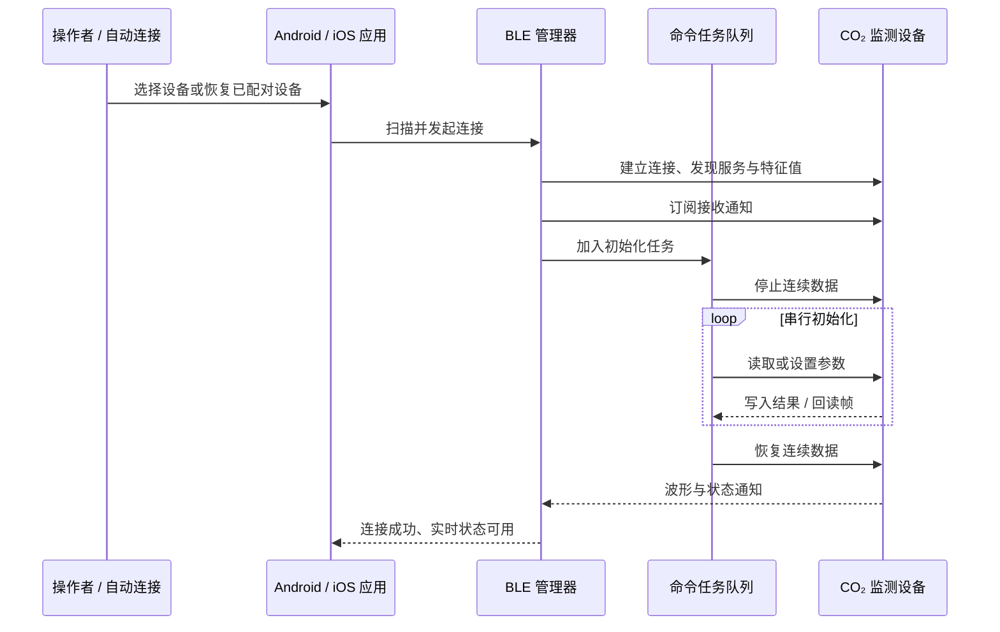
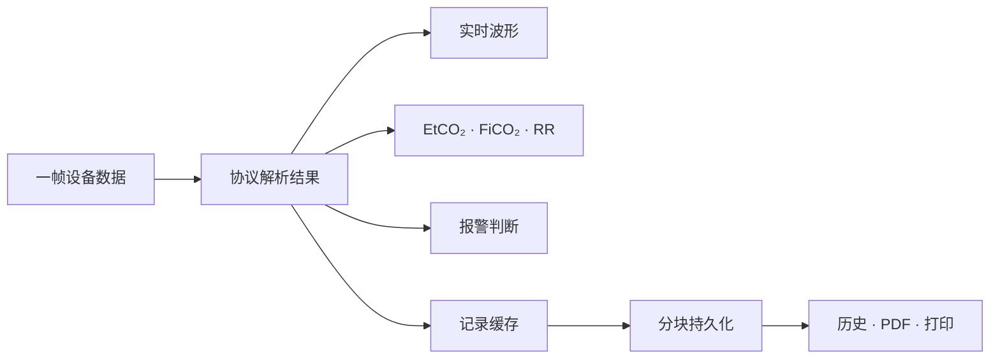

# CapnoEasy BLE 与运行时链路

连接协议实时状态

## 连接与初始化时序

`BlueToothKit`/`BluetoothManager` 负责扫描、连接、服务发现、通知订阅、写特征值、断开和重连。Android 的 `BlueToothTaskQueueKit` 串行执行命令，避免配置命令互相覆盖。

<figure class="wiki-diagram wiki-diagram--wide" markdown>

<figcaption><strong>文字摘要：</strong>连接成功还不等于可监测；只有服务发现、通知订阅和串行参数初始化完成后，实时状态才可用。</figcaption>
</figure>

传输层只应保证“字节可靠到达和连接状态可解释”。UI 导航、患者持久化和报告逻辑不应继续堆入蓝牙管理器。

## 协议解析职责

原始通知经过帧长度与校验，再按 `SensorCommand` 和 DPI/状态位分发。解析结果包括连续 CO₂、EtCO₂、FiCO₂、RR、呼吸/窒息、电量、校零、适配器状态，以及单位、量程、报警范围、补偿和设备版本。

必须用协议样例锁定字节序、缩放因子、符号位、状态位和无效值；UI 不应二次猜测原始字节。

## 同一帧如何扇出

<figure class="wiki-diagram wiki-diagram--wide" markdown>

<figcaption><strong>文字摘要：</strong>一个字段变化至少影响波形、数值、报警和记录四类消费者，评审范围必须覆盖下游报告。</figcaption>
</figure>

## 状态、并发与生命周期

- Android `BlueToothKit` 发布实时 Flow/State，`AppStateModel` 管理导航、设置、记录、患者和报告状态；
- iOS 以 `ObservableObject` / `@Published` 推送状态；
- Hilt 注入与全局单例并存，数据库恢复、Activity 重建和测试替身要确认使用同一运行时实例；
- UI collector 应绑定 Activity/Composable 生命周期，避免重复订阅；
- BLE 回调、Room I/O、PDF 位图和打印应在合适线程执行，主线程只更新 UI；
- 任务队列的取消、超时、断连和重试必须有明确终态；
- 相邻路径仍见 `GlobalScope`、`AsyncTask`、`runBlocking` 等历史模式，改动时应评估收敛。

## 连接改动的最低验证

1. 权限未决定、拒绝、系统设置返回；
2. 扫描无结果、连接超时、服务/特征缺失；
3. 初始化中断、设备拒绝命令、任务超时；
4. 监测中断连、有限重连、重新初始化和状态清理；
5. Android/iOS 使用同一回放帧得到一致关键字段。

完整异常状态图见[故障路径与恢复](../review/failure-paths.md)。
