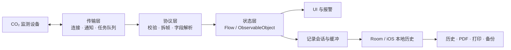
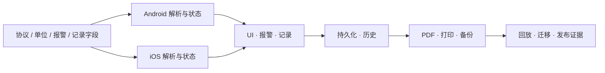

# CapnoEasy 架构总览与数据契约

人工维护最近复核：2026-07-19基线：edfd024

--8<-- "docs_snippets/source-baseline.md"

!!! abstract "先看结论"
    CapnoEasy 不是两个独立 UI 项目，而是 Android 与 iOS 两套原生实现共同承担同一组设备协议和业务语义。BLE 命令、单位、报警边界、采样时间、记录字段和报告内容是默认的跨平台契约。

平台形态<strong>双原生实现</strong><small>Android + iOS</small>

核心链路<strong>BLE → 状态 → 记录</strong><small>最终进入历史与报告</small>

架构原则<strong>语义优先</strong><small>协议和数据不能各自演化</small>

## 分层架构快照

<figure class="wiki-diagram wiki-diagram--wide" markdown>

<figcaption><strong>文字摘要：</strong>设备帧的语义在协议层形成，随后同时进入 UI、报警、记录和输出；任一字段改动都会向下游传播。</figcaption>
</figure>

## 深入阅读

连接、协议、实时状态

**[BLE 与运行时链路](runtime-and-ble.md)**

扫描连接、初始化任务队列、帧解析、状态扇出、并发与生命周期。

记录、数据库、报告

**[持久化、迁移与输出](data-and-delivery.md)**

Room 对象关系、chunk、迁移、备份恢复、PDF/打印与产物追踪。

## 平台与框架

| 维度 | Android | iOS | 审核关注点 |
|---|---|---|---|
| UI | Kotlin、Jetpack Compose、Material3；MPAndroidChart 通过 `AndroidView` 嵌入 | Swift、SwiftUI | 状态生命周期、刷新、无障碍与屏幕尺寸 |
| 状态 | `AppStateModel`、Compose State、StateFlow；Hilt 与单例并存 | `ObservableObject`、`@Published`、单例管理器 | 单一真相源、并发更新、页面销毁后的订阅 |
| 蓝牙 | Android BLE API、`BlueToothKit`、任务队列 | CoreBluetooth、`BluetoothManager` | 权限、状态机、重连、帧完整性、命令串行化 |
| 持久化 | Room 2.5.2、Gson、GZIP、SharedPreferences | 本地文件/历史管理 | 迁移、原子性、损坏恢复、患者数据保护 |
| 报告与打印 | iTextPDF、AndroidPdfViewer、自研热敏打印模块 | PDF 绘制/本地保存；未确认等价热敏打印 | 字段、单位、分页、时间轴、平台差异 |
| 诊断 | Bugly AAR、`ErrorReporter` | 当前 Wiki 未确认等价实现 | 最小字段、隐私、限流后的可观测性 |
| 构建 | Gradle Kotlin DSL、AGP、JDK/JVM 11；compile/target 35、min 30 | Xcode 工程与 scheme | 可复现、签名、release 优化、产物追踪 |

Android App 当前版本为 `1.2` / `versionCode 3`。Docker 构建基线使用 `wei123098/capnograph-android-builder:android-35-agp-8.8.0`，统一入口为 `scripts/package.sh`。

## 一次改动会传播到哪里

<figure class="wiki-diagram wiki-diagram--wide" markdown>

<figcaption><strong>文字摘要：</strong>共享契约变化默认影响两端解析、UI、记录、持久化和输出，不能只验证改动所在页面。</figcaption>
</figure>

## 关键数据契约

| 契约 | 生产者 → 消费者 | 不得破坏的性质 |
|---|---|---|
| BLE 帧与命令值 | 设备 → Android/iOS 协议解析 | 命令编号、字节序、缩放、校验和、状态位一致 |
| 实时指标状态 | 协议解析 → UI、报警、记录 | 同一帧语义一致；线程安全；无效值明确 |
| `CO2WavePointData` | 实时解析 → 图表、Room、PDF、打印 | index/时间单调；字段变更兼容旧记录 |
| 报警范围 | UI/偏好/设备回读 → 下发、判断、报告 | 上下限、闭区间、单位和默认值一致 |
| Room schema | 实体/迁移 → 历史、备份、升级 | 版本、schema、Migration 测试一致 |
| `PrintSetting` | 设置/偏好 → PDF、打印 | 患者字段、模板、水印、趋势开关不串记录 |
| 产物版本 | Gradle/Xcode/打包脚本 → 安装、升级、诊断 | 版本、提交、variant、签名可追踪 |

## 跨平台一致性矩阵

| 领域 | 两端必须对齐的内容 |
|---|---|
| 设备连接 | 可发现设备、服务/特征 UUID、初始化命令、断连与重连 |
| 实时数据 | 字节解析、缩放、单位、无效值、采样时间 |
| 报警 | 默认阈值、边界包含关系、等级、静音/停止行为 |
| 设置 | 单位、量程、波速、无呼吸时间、气体补偿、压力 |
| 记录 | 开始/停止条件、患者字段、时间、数据完整性 |
| 历史与报告 | 排序、字段名、单位、时间轴、波形切段、导出结果 |

平台特有限制必须进入需求、UI 与发布说明，不能默认“功能镜像”。异常场景见[故障路径与恢复](../review/failure-paths.md)。

## 可点击技术证据

- [Android 依赖与 SDK](https://github.com/weisiwu/Capnograph/blob/edfd024010878ede15ae0d16c58308adc8eebef7/apps/android/app/build.gradle.kts)
- [Android 权限](https://github.com/weisiwu/Capnograph/blob/edfd024010878ede15ae0d16c58308adc8eebef7/apps/android/app/src/main/AndroidManifest.xml)
- [Android BLE 与协议](https://github.com/weisiwu/Capnograph/tree/edfd024010878ede15ae0d16c58308adc8eebef7/apps/android/app/src/main/java/com/wldmedical/capnoeasy/kits)
- [iOS 设备与数据](https://github.com/weisiwu/Capnograph/blob/edfd024010878ede15ae0d16c58308adc8eebef7/apps/ios/CapnoGraph/BluetoothManage.swift)
- [构建脚本](https://github.com/weisiwu/Capnograph/blob/edfd024010878ede15ae0d16c58308adc8eebef7/scripts/package.sh)
