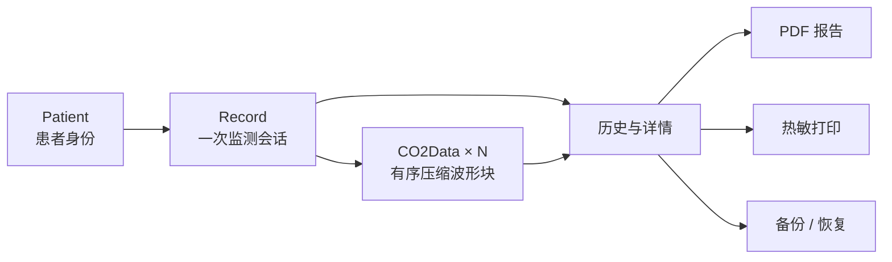
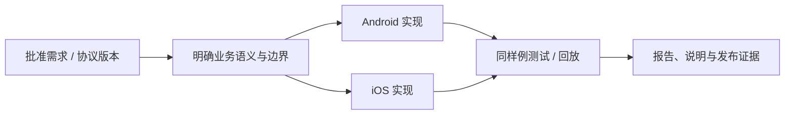

# CapnoEasy 数据对象与业务风险

对象不变量患者数据风险闭环

## 对象与输出关系

<figure class="wiki-diagram wiki-diagram--wide" markdown>

<figcaption><strong>文字摘要：</strong>所有二次载体都必须来自同一患者、同一记录和同一批有序波形块。</figcaption>
</figure>

## 核心不变量

| 对象 | 关键字段 | 必须保持的不变量 |
|---|---|---|
| `Patient` | name、gender、age、id | 身份与记录、报告一致；持久化前校验；切换患者不复用错误字段 |
| `Record` | UUID、patient、startTime、endTime、pdfFilePath | 一次会话一个 UUID；时间顺序有效；不得指向其他患者 |
| `CO2Data` | recordId、chunkIndex、trendData、GZIP data | `recordId + chunkIndex` 唯一；顺序连续；解压失败可诊断 |
| `CO2WavePointData` | co2、RR、ETCO2、FiCO2、sampleTimeMillis、index | index 与采样时间单调；单位解释一致；旧记录可回放 |
| `PrintSetting` | 医院/报告/患者字段、模板、水印、趋势开关 | 配置不污染其他患者；正式/调试模板语义明确 |

## 当前风险与业务决定

| 风险 | 可能影响 | 需要的业务 / 审核决定 |
|---|---|---|
| 报警区间条件疑似反向 | 错误触发或遗漏生理报警 | 批准上下限语义、边界包含关系、设备回读与报告一致性 |
| 停止记录未更新结束时间 | 时长、回放时间轴、历史排序失真 | “结束时间”的业务定义和停止失败时的处理 |
| chunk 大小为临时值 100 | I/O、趋势抽样、长记录性能 | 生产参数、最大记录时长和旧记录兼容策略 |
| 患者字段进入偏好、PDF、文件名 | 可识别个人信息扩散 | 最小字段、保留期、导出命名和删除规则 |
| 大范围存储与后台位置权限 | 隐私和商店审核面扩大 | 权限必要性、系统选择器和应用私有目录替代方案 |
| Android/iOS 能力不完全镜像 | 用户预期与交付范围漂移 | 平台差异是否批准、如何在 UI 与发布说明公开 |

## 业务规则变更的最小追踪

<figure class="wiki-diagram wiki-diagram--wide" markdown>

<figcaption><strong>文字摘要：</strong>业务规则必须同时落到双平台实现、测试和输出，不能只改变一个页面或一个常量。</figcaption>
</figure>

## 患者数据边界

采集、存储、导出、诊断、备份、保留与删除的完整信任边界见[患者数据生命周期](../review/patient-data-lifecycle.md)。这里至少保持三条业务原则：

1. 当前患者输入不能自动污染历史记录或下一位患者；
2. PDF、打印、备份必须使用稳定记录快照，不能拼接当前 UI 状态；
3. 诊断系统默认不知道患者身份，不能为了排错上传姓名、ID、科室、床号或原始波形。

## 风险关闭入口

所有当前风险以[审核总览的基线表](../review/review-guide.md#baseline-findings)为唯一关闭入口；异常路径使用[故障路径与恢复](../review/failure-paths.md)设计测试，最终证据进入[发布证据包](../review/release-evidence.md#release-package)。
