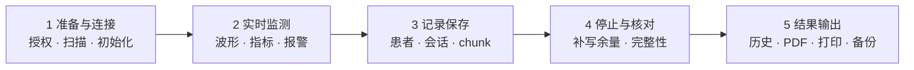

# CapnoEasy 业务领域与端到端流程

人工维护最近复核：2026-07-19基线：edfd024

--8<-- "docs_snippets/source-baseline.md"

!!! abstract "本页回答"
    CapnoEasy 服务谁、设备数据如何走到监测记录与报告、关键业务动作有哪些门槛。对象字段、不变量和风险表已拆到[数据对象与业务风险](data-and-risks.md)。

!!! danger "发布前先看"
    当前有两项 P0 待确认：EtCO₂/RR 报警区间条件疑似反向，以及停止记录时未见 `Record.endTime` 更新。关闭条件见[审核总览](../review/review-guide.md#baseline-findings)。

## 产品定位与边界

CapnoEasy 是二氧化碳监测设备的移动端配套应用。当前代码覆盖设备连接、实时监测、报警提示、记录与历史、报告与输出。

仓库只能证明软件实现，不能证明医疗器械注册状态、临床适应证、诊断结论或报警参数的医学有效性。正常范围、报警等级、默认值和报告用语必须回到批准需求、设备协议及临床/法规评审记录。

## 参与者与外部系统

| 参与者 / 系统 | 职责 | 主要交互 |
|---|---|---|
| 设备操作者 | 连接、录入患者、观察、记录、导出或打印 | Android/iOS UI |
| 患者 | 监测记录的业务主体 | 姓名、性别、年龄、住院号、科室、床号 |
| CO₂ 监测设备 | 提供波形、EtCO₂、FiCO₂、RR 和设备状态 | BLE 服务、特征值与命令协议 |
| 热敏打印机 | 输出历史记录与波形小票 | Android 经典蓝牙 |
| 本地存储 | 保存患者、记录、压缩波形和偏好 | Android Room；iOS 本地历史 |
| Bugly | Android 崩溃和非致命异常诊断 | 只允许最小技术字段，不得携带患者身份 |

## 核心术语

| 术语 | 项目中的含义 | 当前表示 |
|---|---|---|
| CO₂ waveform | 连续二氧化碳波形采样 | `CO2WavePointData.co2` |
| EtCO₂ / FiCO₂ | 呼气末 / 吸入二氧化碳值 | `currentETCO2` / `currentFiCO2` |
| RR | 呼吸频率 | `currentRespiratoryRate` |
| 呼吸检测 / 窒息 | 设备检测呼吸 / 超时未检测到呼吸 | `currentBreathe` / `isAsphyxiation` |
| 校零 | 对传感器执行零点校正 | `correctZero` |
| 生理 / 技术报警 | 数值或窒息等 / 校零或适配器异常 | 中级 / 低级报警音 |
| 记录 | 一次监测会话及患者、时间、波形和报告引用 | `Record` + 多个 `CO2Data` |

CO₂ 单位支持 `mmHg`、`kPa` 和 `%`。显示量程、报警阈值、报告参考范围和设备下发值必须使用同一单位语义。

## 一次完整业务旅程

<figure class="wiki-diagram wiki-diagram--wide" markdown>

<figcaption><strong>文字摘要：</strong>业务主线依次经过连接、监测、记录、停止和输出；每个阶段都有失败路径和证据门槛。</figcaption>
</figure>

## 1. 启动、搜索与连接

- Android 启动时恢复语言、显示、报警和打印偏好，并尝试连接已保存的 BLE 设备；
- 用户可从设备列表主动扫描和连接；
- 连接后发现服务、订阅通知，并串行读取或设置单位、量程、报警范围、无呼吸时间和补偿参数；
- 权限拒绝、超时、断连与重连必须回到可解释状态，详见[故障路径](../review/failure-paths.md)。

## 2. 实时监测与报警

设备通知经校验与协议分发后更新波形、生命体征和设备状态；主页通过可观察状态刷新数值和图表。

当前报警分级实现：窒息、EtCO₂/RR 异常和低电量使用中级报警音；需校零、适配器无效或污染使用低级报警音；条件恢复正常时停止声音。

**待确认：** Android 对 EtCO₂/RR 的“有效区间”使用 `value <= start && value >= endInclusive`。对通常升序区间可能无法成立，必须用批准规则、五点边界和设备回放共同关闭。

## 3. 开始与停止记录

1. 未连接监测设备时不能开始，并引导到搜索页；
2. 姓名、性别、年龄、住院号/ID、科室和床号任一为空时不能开始；
3. 开始时创建 `Patient` 和 `Record`；
4. 实时波形由图表收集路径分块写入，而不是 `saveRecord` 一次保存；
5. 停止时补写不足一个 chunk 的余量，再清空 `currentRecordId`。

**待确认：** 新 `Record.endTime` 在开始时即赋值，而 `stopRecord` 未见更新。记录时长、PDF 时间轴和历史排序必须覆盖这一行为。

## 4. 历史、报告、打印与备份

- 历史详情按 `chunkIndex` 读取并解压波形；
- PDF 经系统文档创建器保存；Android 可连接热敏打印机输出文本和波形；
- PDF、打印和备份属于患者数据的二次载体，必须来自同一记录快照；
- Room 恢复会关闭并重建实例，需校验记录数量、外键、chunk 连续性和版本迁移。

## 按角色继续阅读

产品与质量

阅读[数据对象与业务风险](data-and-risks.md)，确认对象不变量、患者数据和当前待确认项。

研发

阅读[架构总览与数据契约](../architecture/technical-architecture.md)，评估跨平台传播范围。

测试与发布

阅读[领域审核清单](../review/domain-checklists.md)和[测试与发布证据](../review/release-evidence.md)。

## 可点击代码证据

- [Android 记录入口](https://github.com/weisiwu/Capnograph/blob/edfd024010878ede15ae0d16c58308adc8eebef7/apps/android/app/src/main/java/com/wldmedical/capnoeasy/pages/MainActivity.kt)
- [实时波形与报警](https://github.com/weisiwu/Capnograph/blob/edfd024010878ede15ae0d16c58308adc8eebef7/apps/android/app/src/main/java/com/wldmedical/capnoeasy/kits/BlueToothKit.kt)
- [分块持久化](https://github.com/weisiwu/Capnograph/blob/edfd024010878ede15ae0d16c58308adc8eebef7/apps/android/app/src/main/java/com/wldmedical/capnoeasy/components/EtCo2LineChart.kt)
- [iOS 设备与历史](https://github.com/weisiwu/Capnograph/tree/edfd024010878ede15ae0d16c58308adc8eebef7/apps/ios/CapnoGraph)
