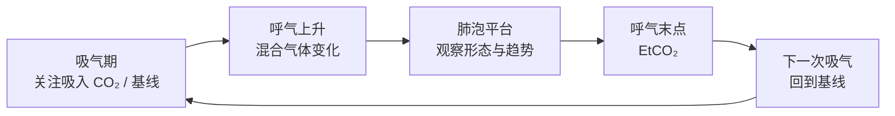
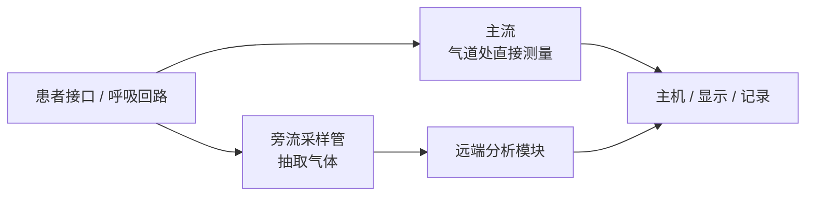
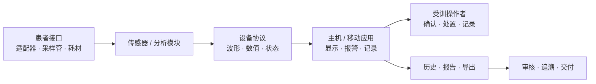

# 二氧化碳描记行业与业务背景

行业知识临床与产品共同审核不等同于产品预期用途

!!! abstract "本页回答"
    二氧化碳描记是什么、行业为什么使用它、EtCO₂ / FiCO₂ / RR 与波形各回答什么问题、主流和旁流方案如何区别，以及设备、软件和操作者分别承担什么责任。CapnoEasy 自身的功能与流程请进入[应用业务与端到端流程](domain-and-workflows.md)。

!!! warning "边界声明"
    本页是行业背景，不是诊疗指南，也不能证明 CapnoEasy 的注册状态、适用人群、使用场景或报警阈值。任何临床解释、默认值和报警策略，都必须回到获批需求、设备协议、风险管理和适用地区的法规/标准评审。

## 先区分两个知识层

| 知识层 | 回答的问题 | 主要证据 | 在本 Wiki 的位置 |
|---|---|---|---|
| 行业与业务背景 | 行业为什么监测呼吸气体、常见概念与技术路线是什么 | 临床指南、标准、监管资料 | 当前页面 |
| CapnoEasy 应用业务 | 当前应用具体做什么、数据怎样形成记录和输出 | 当前源码、配置、迁移与测试 | [应用业务与端到端流程](domain-and-workflows.md) |

行业实践不能自动推导为产品能力；应用中出现某个字段，也不能自动证明它符合临床或法规要求。

## 什么是二氧化碳描记

二氧化碳描记（capnography）关注呼吸气体中 CO₂ 随时间或呼出容量变化形成的连续波形，并通常同时给出呼气末、吸气期和呼吸频率等数值。只给出 CO₂ 数值而没有连续波形或记录时，行业资料常使用 capnometry 描述。

[AARC 机械通气临床实践指南](https://www.aarc.org/wp-content/uploads/2014/08/04.11.0503.pdf)把波形 capnography 与仅数值 capnometry 分开，并把人工气道位置确认、肺循环与呼吸状态评估、机械通气优化列为主要使用类别。

二氧化碳描记与脉搏血氧并非替代关系：前者主要提供通气、呼出气流和部分循环变化线索，后者主要反映氧合。实际判断还需要结合患者状态、气道、设备、其他监护和临床评估。

## 一次呼吸里看什么

<figure class="wiki-diagram wiki-diagram--wide" markdown>

<figcaption><strong>文字摘要：</strong>数值说明某一时点或周期，波形说明整个呼吸过程；基线、上升、平台和回落都可能提供信息，但不能脱离患者与设备条件单独诊断。</figcaption>
</figure>

## 核心参数的行业含义

| 参数 | 行业中的基本定义 | 主要回答 | 使用限制 |
|---|---|---|---|
| EtCO₂ | 一次呼吸在呼气末测得的 CO₂ 浓度或分压 | 呼气末 CO₂ 及其趋势怎样变化 | 不等同于动脉血 PaCO₂；差异受通气、灌注、死腔和测量条件影响 |
| FiCO₂ | 吸气阶段测得的 CO₂ 浓度或分压 | 吸入基线是否抬高、是否可能存在回吸或系统问题 | 必须结合采样方式、回路、环境与设备状态解释 |
| RR | 从呼吸周期或设备事件计算的呼吸频率 | 呼吸节律与频率是否变化 | 无波形、漏采样、浅呼吸、运动或断连都可能影响结果 |
| Capnogram | CO₂ 随时间或容量变化的连续波形 | 呼吸周期、呼出气流、基线与平台如何变化 | 波形质量取决于气道接口、采样、延迟、污染、冷凝和算法 |

这里不提供“通用正常值”。人群、场景、单位、设备、海拔、通气方式和获批产品定义不同，不能把某个资料中的区间直接写成 CapnoEasy 报警规则。

## 典型行业场景

以下是行业指南覆盖的常见问题，不代表 CapnoEasy 已获批或适用于全部场景：

| 场景 | 二氧化碳描记回答的问题 | 仍需结合 |
|---|---|---|
| 人工气道与机械通气 | 气道位置与通气是否持续、回路是否可能断开 | 临床观察、气道检查、呼吸机与其他监护 |
| 机械通气调整 | 呼出 CO₂、趋势、死腔和患者—呼吸机交互怎样变化 | 血气、肺部情况、通气参数与临床目标 |
| 院内/院外转运 | 转运中气道和通气连续性是否改变 | 转运协议、备用设备、氧合与生命体征 |
| 复苏 | 插管患者的波形与 EtCO₂ 趋势可辅助观察按压质量和循环恢复线索 | 复苏指南、节律、脉搏和完整临床判断 |
| 麻醉与镇静监测 | 呼出 CO₂ 是否持续、通气是否出现变化 | 麻醉/镇静级别、气道、药物、氧合及机构规范 |

关于机械通气、转运与人工气道确认，可参考[AARC 指南](https://www.aarc.org/wp-content/uploads/2014/08/04.11.0503.pdf)。复苏场景必须采用对应人群的最新指南；例如 [2025 AHA/AAP 儿童高级生命支持指南](https://www.ahajournals.org/doi/10.1161/CIR.0000000000001368)强调 EtCO₂ 可作为 CPR 质量线索，但不建议仅用特定 EtCO₂ 截止值决定终止儿童复苏。

## 主流与旁流技术路线

<figure class="wiki-diagram wiki-diagram--wide" markdown>

<figcaption><strong>文字摘要：</strong>主流在气道处测量，旁流把气体送到远端分析；选择时要同时评估响应、接口负担、采样管、冷凝、污染、校零、耗材和适用人群。</figcaption>
</figure>

| 维度 | 主流（mainstream） | 旁流（sidestream） |
|---|---|---|
| 测量位置 | 传感器/测量窗位于呼吸回路或气道适配器处 | 通过采样管把气体送往远端分析器 |
| 常见实现 | 气道适配器 + 红外传感器 + 主机接口 | 采样接口 + 采样管 + 泵/气路 + 红外分析模块 |
| 工程关注 | 气道端重量、死腔、适配器、清洁/消毒和线缆 | 传输延迟、采样流量、堵塞、漏气、冷凝和耗材 |
| 质量控制 | 光路、适配器污染、安装和校准 | 采样管状态、水汽、过滤、泵和校零 |

[AARC 指南](https://www.aarc.org/wp-content/uploads/2014/08/04.11.0503.pdf)给出了主流与旁流的基本区别，并列出采样管过长、分泌物、冷凝和采样腔堵塞等旁流误差来源。FDA 公开的[主流 CO₂ 传感器 K221118](https://www.accessdata.fda.gov/cdrh_docs/pdf22/K221118.pdf)和[旁流 CO₂ 模块 K192488](https://www.accessdata.fda.gov/cdrh_docs/pdf19/K192488.pdf)则展示了红外吸收测量、主机接口和校零等产品化实现示例。

## 行业产品与业务链

<figure class="wiki-diagram wiki-diagram--wide" markdown>

<figcaption><strong>文字摘要：</strong>软件处在设备测量与人员决策之间；它既不能掩盖传感器/采样错误，也不能把算法输出直接包装成诊断结论。</figcaption>
</figure>

行业产品通常跨越耗材、气路/传感器、固件协议、显示报警、记录报告和质量体系。对移动配套应用而言，业务价值不仅是“显示数字”，还包括：

1. 把设备状态、单位、波形和报警放进同一可解释界面；
2. 保持连接、校零、异常与恢复过程可见；
3. 把一次监测形成可追溯记录，而不混入下一位患者；
4. 让报告、打印、备份和审计引用同一数据快照；
5. 对传感器、采样、通信、算法和软件错误给出不同的处置线索。

## 标准与监管视角

[ISO 80601-2-55:2018](https://www.iso.org/standard/67241.html)规定呼吸气体监护设备的基本安全和基本性能专用要求，覆盖二氧化碳、氧和麻醉气体监测；ISO 页面显示该版本在 2026 年复核确认仍为现行版本，并有 2023 年修订件。

FDA 公开资料中，气相二氧化碳分析仪使用 21 CFR 868.1400 / 产品代码 CCK，公开 510(k) 文件也展示了主流、旁流传感器及其主机关系。但这只能说明美国监管示例，不能直接推导 CapnoEasy 在任何国家或地区的分类、适用标准或上市状态。

产品评审至少要分别确认：

- 监测设备、传感器/模块、患者接口和软件各自的法规定义；
- 软件是显示主机、附件、独立医疗器械软件还是记录工具；
- 预期用途、人群、场景和操作者；
- 基本安全、基本性能、电磁兼容、软件生命周期、可用性和风险管理要求；
- 报警、单位、记录、报告、数据保护和网络安全要求；
- 适用标准的版本、偏差、地区转换和验证证据。

## 从行业知识进入 CapnoEasy

行业层解释“为什么”和“通常怎样”；应用层解释“当前代码实际做了什么”。继续阅读：

- [CapnoEasy 应用业务与端到端流程](domain-and-workflows.md)
- [CapnoEasy 数据对象与业务风险](data-and-risks.md)
- [技术架构与数据契约](../architecture/technical-architecture.md)
- [审核总览与发布门禁](../review/review-guide.md)

## 参考来源与复核说明

| 来源 | 本页用途 | 局限 |
|---|---|---|
| [AARC Capnography/Capnometry During Mechanical Ventilation: 2011](https://www.aarc.org/wp-content/uploads/2014/08/04.11.0503.pdf) | 术语、主流/旁流、机械通气、人工气道、转运和误差来源 | 2011 年机械通气指南；不能替代当前地区和场景指南 |
| [ISO 80601-2-55:2018](https://www.iso.org/standard/67241.html) | 呼吸气体监护设备的标准范围 | 标准适用性和符合性需项目法规评审 |
| [FDA K221118](https://www.accessdata.fda.gov/cdrh_docs/pdf22/K221118.pdf) | 主流红外传感器、主机接口和监管示例 | 单一获批产品示例，不代表 CapnoEasy |
| [FDA K192488](https://www.accessdata.fda.gov/cdrh_docs/pdf19/K192488.pdf) | 旁流红外模块、采样和校零实现示例 | 单一获批产品示例，不代表 CapnoEasy |
| [2025 AHA/AAP PALS](https://www.ahajournals.org/doi/10.1161/CIR.0000000000001368) | 儿童复苏中 EtCO₂ 使用边界示例 | 仅适用于对应指南范围 |
