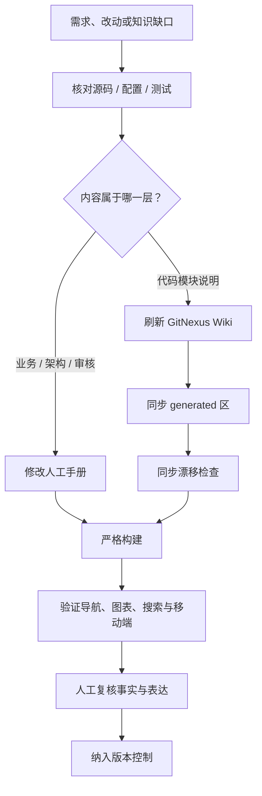
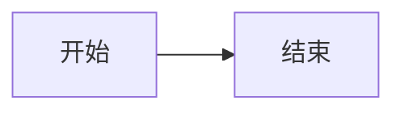

# 文档生成与维护

<div class="doc-status" markdown>
<span>人工维护</span><span>最近复核：2026-07-19</span><span>适用：MkDocs + GitNexus</span>
</div>

--8<-- "docs_snippets/source-baseline.md"

!!! abstract "维护原则"
    人工手册与自动生成区分开维护；正式发布前以锁定依赖完成严格构建，并用构建后的静态站验证搜索、导航和离线资源。

## 文档从事实到站点

<figure class="wiki-diagram wiki-diagram--wide" markdown>



<figcaption>图 1：生成、写作和发布是三件不同的事；生成成功不等于事实与页面已经通过验收。</figcaption>
</figure>

## 内容所有权

| 路径 | 所有者 | 更新方式 | 是否允许生成器覆盖 |
|---|---|---|---|
| `docs/guide/` | 产品、研发、质量共同维护 | 人工修改 | 否 |
| `docs/business/` | 产品、业务、研发共同审核 | 人工修改 | 否 |
| `docs/architecture/` | Android、iOS、架构负责人 | 人工修改 | 否 |
| `docs/review/` | 研发、测试、质量、发布负责人 | 人工修改 | 否 |
| `docs/generated/gitnexus/` | GitNexus | 同步脚本重建 | 是 |
| `docs/assets/` | 文档维护者 | 人工修改与构建验证 | 否 |
| `.gitnexus/wiki/` | GitNexus 本地运行时 | `gitnexus wiki` | 是，且不进入 Git |
| `site/` | MkDocs | `mkdocs build` | 是，且不进入 Git |

## 首次安装

建议使用项目外或被 Git 忽略的虚拟环境：

```bash
python3 -m venv .venv-docs
.venv-docs/bin/python -m pip install -r requirements-docs.txt
```

## 本地预览和严格构建

```bash
# 浏览器实时预览
.venv-docs/bin/mkdocs serve

# 严格构建：警告视为失败
.venv-docs/bin/mkdocs build --strict

# 验证正式静态产物（包括搜索）
python3 -m http.server 8000 --directory site
```

构建结果位于 `site/`。启用 `privacy` 和 `offline` 插件后，主题依赖、搜索和文档页面会进入本地产物，适合通过 `site/index.html` 离线浏览。

`mkdocs serve` 适合实时检查排版；`offline` 搜索应以严格构建后的 `site/` 为验收对象。打开 `http://127.0.0.1:8000/`，至少验证一个中文关键词、一个英文符号名和一个无结果关键词。

## 流程图、时序图和说明图

图表统一使用 Mermaid，源代码跟随 Markdown 保存。Material for MkDocs 会把 Mermaid 源码渲染为主题自适应图表；本 Wiki 额外提供缩放、重置、全屏和打印/保存入口，手机端仍可在图内横向滚动。

新增或修改图表时遵循以下规则：

1. 图前先写一句“这张图回答什么”，图后用 `figcaption` 说明范围或限制；
2. 每张图提供 `accTitle` 和 `accDescr`，让辅助技术能够识别图意；
3. 业务流程使用业务动作，不把函数名塞进节点；函数和文件证据放在图注或证据入口；
4. 时序图只表达源码已确认的调用与状态变化，待确认行为必须明确标注；
5. 图注以“文字摘要”开头，静态说明主要关系和限制，不让理解完全依赖 SVG；
6. 宽图放入 `wiki-diagram--wide` 容器，在手机端允许图内横向滚动，不能让整页溢出；
7. 严格构建后，用键盘操作缩放/全屏控件，并逐图确认文字、深浅主题与移动端布局；不能只检查构建日志。

推荐结构：

````markdown
<figure class="wiki-diagram wiki-diagram--wide" markdown>



<figcaption>图注说明范围、证据或限制。</figcaption>
</figure>
````

## 刷新 GitNexus 自动文档

```bash
# 1. 更新代码知识图谱
node .gitnexus/run.cjs analyze

# 2. 生成本地 Wiki；需要模型 API Key
node .gitnexus/run.cjs wiki --lang chinese

# 3. 把自动页面同步到受 Git 管理的 generated 区
python3 scripts/sync_gitnexus_wiki.py

# 4. 验证生成区没有漂移并严格构建
python3 scripts/sync_gitnexus_wiki.py --check
mkdocs build --strict
```

如果使用仓库 README 中的自定义 DeepSeek 参数，第二步以 README 命令为准。

## 更新规则

1. 修改业务、架构或审核手册前，先核对当前源码、配置和测试；
2. GitNexus 自动页面包含过时或错误事实时，优先修正源码对应上下文，再重新生成；
3. 不要在 `docs/generated/gitnexus/` 中手工修补，修改会在下次同步时丢失；
4. 自动生成内容与人工手册冲突时，以源码和人工审核后的手册为准，并记录待同步点；
5. 新增页面要包含 YAML frontmatter，并同步 `mkdocs.yml` 的 `nav`；
6. 合并前至少运行 `mkdocs build --strict`、生成区同步检查和页面图表检查。

## 自动质量门禁

`.github/workflows/docs.yml` 在 Wiki 相关文件变化时执行三层检查：

1. `scripts/sync_gitnexus_wiki.py --check`：自动页面必须与 GitNexus 源同步；
2. `scripts/check_wiki.py`：每页恰好一个 H1、本地图内链存在、Mermaid 具备 `accTitle`/`accDescr`，且不能泄露 GitNexus 临时目录标题；
3. `mkdocs build --strict`：导航、配置、Markdown 与离线站点必须零警告构建。

本地提交前运行：

```bash
python3 scripts/sync_gitnexus_wiki.py --check
python3 scripts/check_wiki.py
.venv-docs/bin/mkdocs build --strict
```

## 写作与审稿约定

Wiki 面向产品、研发、测试、质量和交付共同阅读。内容应先讲清业务或技术结论，再给代码证据，最后说明限制，避免让读者先穿过一串函数名才能理解问题。

- **标题回答问题**：优先写“实时数据如何到达屏幕”，少写“数据相关说明”；
- **结论放前面**：段落第一句说清当前事实，后文再补实现入口和例外；
- **区分事实与要求**：使用“当前实现”“待确认”“审核要求”，不要把建议写成已实现行为；
- **一个术语一种写法**：EtCO₂、FiCO₂、RR、记录、chunk 等名称在业务、架构和审核页保持一致；
- **函数名不代替解释**：正文先写业务动作或系统职责，符号与路径放在证据入口；
- **医学与法规表述克制**：仓库未提供批准证据时，不写适应证、诊断结论或医学有效性断言；
- **让清单可执行**：每个检查项必须能回答“谁验证、用什么证据、什么条件算通过”。

提交前快速审稿：删除重复背景，拆分过长句子，检查代词指向，确认图、表、正文使用相同术语，并验证每个风险都有明确的证据入口或关闭条件。

## 发布选择

`site/` 是普通静态文件，可发布到 GitHub Pages、GitLab Pages、对象存储或内部静态服务器。仓库当前只配置生成和验证流程，没有自动向外部平台发布，避免未经授权公开项目与患者相关知识。
