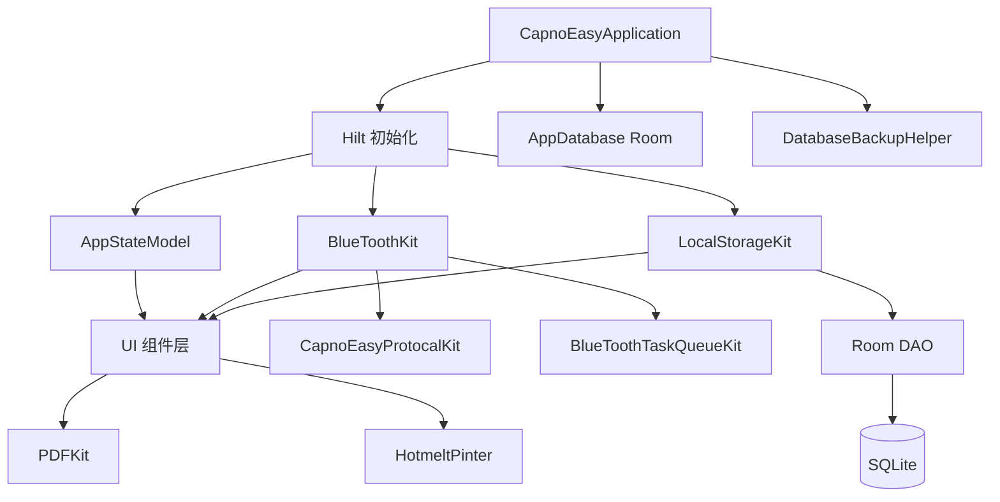

!!! info "GitNexus 自动生成"
    来源提交：`edfd024010878ede15ae0d16c58308adc8eebef7`；生成时间：`2026-07-18T16:08:03.557Z`。
    本页允许同步脚本覆盖；涉及行为判断时请回到当前源码、配置和测试核验。
# apps/android 模块文档

## 概述

`apps/android` 是 CapnoEasy 项目的 Android 应用主模块，负责构建一个基于蓝牙的二氧化碳监测设备配套应用。该模块实现了设备扫描连接、实时波形显示、数据记录存储、PDF 报告生成、热敏打印以及与硬件设备的双向通信等核心功能。

## 技术栈

- **构建系统**: Gradle + Kotlin DSL
- **UI 框架**: Jetpack Compose + Material3
- **依赖注入**: Hilt (Dagger)
- **本地存储**: Room (SQLite)
- **蓝牙通信**: Android Bluetooth API
- **PDF 生成**: iTextPDF 5.5.13.4
- **图表**: MPAndroidChart
- **图片加载**: Coil
- **崩溃监控**: Bugly

## 项目结构

```
apps/android/
├── app/
│   ├── build.gradle.kts          # 模块构建配置
│   ├── proguard-rules.pro        # 混淆规则
│   ├── data_version_list.txt     # 数据库版本变更记录
│   ├── schemas/                  # Room 数据库 schema 导出
│   └── src/
│       ├── main/
│       │   ├── AndroidManifest.xml
│       │   └── java/com/wldmedical/capnoeasy/
│       │       ├── CapnoEasyApplication.kt      # Application 入口
│       │       ├── CapnoEasyConstant.kt          # 全局常量与枚举
│       │       ├── components/                   # UI 组件
│       │       ├── kits/                         # 核心业务逻辑
│       │       ├── models/                       # 状态模型
│       │       ├── pages/                        # 页面
│       │       └── ui/                           # 主题
│       ├── test/                                 # 单元测试
│       └── androidTest/                          # 仪器化测试
├── JDK_SETUP.md                  # JDK 本地配置说明
└── PROJECT_POTENTIAL_ISSUES.md   # 项目潜在问题分析
```

## 核心架构



### 关键组件说明

| 组件 | 文件 | 职责 |
|------|------|------|
| `CapnoEasyApplication` | `CapnoEasyApplication.kt` | 应用入口，初始化数据库、备份、错误报告 |
| `AppStateModel` | `models/AppStateModel.kt` | 全局状态管理，576 行 |
| `BlueToothKit` | `kits/BlueToothKit.kt` | 蓝牙连接、数据收发、协议解析，1583 行 |
| `LocalStorageKit` | `kits/LocalStorageKit.kt` | Room 数据库操作封装，673 行 |
| `PDFKit` | `kits/PDFKit.kt` | PDF 报告生成，1154 行 |
| `HotmeltPinter` | `kits/HotmeltPinter.kt` | 热敏打印控制，432 行 |

## 构建配置

### 版本信息

- `compileSdk = 35`, `targetSdk = 35`, `minSdk = 30`
- `versionCode = 3`, `versionName = "1.2"`
- Java/Kotlin 目标版本: `VERSION_11` / `jvmTarget = "11"`

### 构建类型

- **debug**: Bugly 调试模式开启，无混淆
- **release**: 启用混淆 (`isMinifyEnabled = true`) 和资源压缩 (`isShrinkResources = true`)

### 自定义 Gradle 任务

模块定义了三个安装相关任务：

- `uninstallDebugApp`: 卸载已安装的调试版本
- `launchDebugApp`: 启动已安装的调试版本
- `reinstallDebugAndLaunch`: 卸载 → 安装 → 启动（一键部署）

支持通过 `adbSerial` Gradle 属性指定特定设备。

## 数据库设计

### 版本历史

- **v1**: 包含 `patients` 和 `records` 两张表，`Record` 直接内嵌 `List<CO2WavePointData>`
- **v2**: 新增 `co2_data` 表，将波形数据分块存储，通过外键关联 `Record`

### 当前表结构 (v2)

```kotlin
// patients 表
@Entity(tableName = "patients")
data class Patient(
    val name: String,
    val gender: GENDER,
    val age: Int,
    @PrimaryKey(autoGenerate = true) val id: Int = 0
)

// records 表
@Entity(tableName = "records")
data class Record(
    @PrimaryKey(autoGenerate = false) var id: UUID,
    val patient: Patient,
    val startTime: LocalDateTime,
    var endTime: LocalDateTime,
    var pdfFilePath: String?,
    // previewPdfFilePath 保留字段但不再使用
)

// co2_data 表（v2 新增）
@Entity(
    tableName = "co2_data",
    foreignKeys = [ForeignKey(
        entity = Record::class,
        parentColumns = ["id"],
        childColumns = ["recordId"],
        onDelete = ForeignKey.CASCADE
    )],
    indices = [Index(value = ["recordId", "chunkIndex"], unique = true)]
)
data class CO2Data(
    @PrimaryKey(autoGenerate = true) val id: Long = 0,
    val recordId: UUID,
    val chunkIndex: Int,
    val trendData: String,  // 趋势图数据，格式 "1.03_1.2_33_44"
    val data: ByteArray     // 压缩后的波形数据
)
```

### 数据流

波形数据采集流程：
1. 蓝牙接收实时数据 → `BlueToothKit.dataFlow`
2. 数据累积到 `totalCO2WavedData`（StateFlow）
3. 达到 `maxRecordDataChunkSize` 时触发存储；当前实际值为带 `TODO: 临时测试` 标记的 100 点，注释中的原候选值为 10000 点，发布前必须固定生产参数
4. 压缩数据并计算趋势数据 → 写入 `co2_data` 表
5. 从 `totalCO2WavedData` 中移除已存储的 chunk

## 蓝牙通信

### 连接流程

1. `SearchActivity` 扫描 BLE 设备
2. 用户选择设备 → `BlueToothKit.connectToDevice()`
3. 发现服务 → 订阅通知特征
4. 发送初始化指令（停止连续模式、设置单位等）
5. 开始接收实时数据

### 协议解析

`CapnoEasyProtocalKit` 负责解析设备协议：

- `BLEServersUUID`: 定义服务 UUID
- `convert16BitUUIDto128Bit`: UUID 格式转换
- 数据通过 `onCharacteristicChanged` 回调接收
- `getSpecificValue` 解析不同指令类型的数据

### 任务队列

`BlueToothTaskQueueKit` 实现指令发送的排队机制：

- `addTasks`: 添加待发送指令
- `executeAllTasks`: 按序执行
- `executeTask`: 单条指令执行
- 支持重试和错误报告

## UI 组件

### 公共组件

| 组件 | 用途 |
|------|------|
| `ActionBar` | 底部导航栏（搜索/主页/设置） |
| `NavBar` | 顶部导航栏，含录制/停止按钮 |
| `AlertModal` | 双按钮确认弹框 |
| `ConfirmModal` | 单按钮确认弹框 |
| `ActionModal` | 底部操作面板（导出 PDF/打印） |
| `Loading` | 全局加载遮罩 |
| `EtCo2LineChart` | 实时 CO2 波形图 |
| `EtCo2Table` | 患者信息与监测数据表格 |
| `DeviceList` | 蓝牙设备列表 |
| `HistoryList` | 历史记录列表（支持分组） |
| `SettingList` | 设置项列表 |
| `CustomTextField` | 自定义输入框 |
| `RangeSelector` | 范围选择器 |
| `TypeSwitch` | 类型切换开关 |

### 页面

| 页面 | 用途 |
|------|------|
| `SplashActivity` | 启动页 |
| `MainActivity` | 主页（波形显示 + 患者信息） |
| `SearchActivity` | 设备搜索 |
| `SettingActivity` | 设置入口 |
| `AlertSettingActivity` | 报警参数设置 |
| `DisplaySettingActivity` | 显示参数设置 |
| `ModuleSettingActivity` | 模块参数设置 |
| `PrintSettingActivity` | 打印设置 |
| `SystemSettingActivity` | 系统设置 |
| `HistoryRecordsActivity` | 历史记录列表 |
| `HistoryRecordDetailActivity` | 历史记录详情 |

## 已知问题与风险

根据 `PROJECT_POTENTIAL_ISSUES.md` 分析，当前模块存在以下主要问题：

### P1 高风险

1. **Manifest 权限过多**: 声明了 `ACCESS_BACKGROUND_LOCATION`、`MANAGE_EXTERNAL_STORAGE` 等敏感权限
2. **蓝牙权限 suppress**: `BlueToothKit` 多处使用 `@SuppressLint("MissingPermission")`
3. **强制非空**: 多处使用 `!!`，可能导致空指针崩溃
4. **协程未绑定生命周期**: 使用 `GlobalScope.launch` 和 `AsyncTask`
5. **Room schema 未导出**: v2 schema 未提交，迁移测试缺失
6. **备份恢复未完成**: `DatabaseBackupHelperKit` 处于半完成状态

### P2 中等风险

1. **核心类过大**: `BlueToothKit` (1583行)、`PDFKit` (1154行) 等
2. **依赖重复**: `foundation-layout-android` 重复声明 4 次
3. **生产调试输出**: 大量 `println` 和 `printStackTrace`
4. **测试覆盖不足**: 仅 4 个模板测试文件

## 开发指南

### 本地 JDK 配置

不要修改项目根目录的 `gradle.properties`，应在用户级配置中设置：

```properties
# ~/.gradle/gradle.properties
org.gradle.java.home=/path/to/local/jdk
```

### 常用命令

```bash
# 编译
./gradlew :app:compileDebugKotlin

# 运行测试
./gradlew :app:testDebugUnitTest

# 一键部署
./gradlew :app:reinstallDebugAndLaunch

# 指定设备
./gradlew :app:reinstallDebugAndLaunch -PadbSerial=emulator-5554
```

### 数据库迁移

添加新版本时需：

1. 更新 `AppDatabase.version`
2. 实现 `Migration` 类
3. 在 `build.gradle.kts` 中确保 `room.schemaLocation` 配置正确
4. 提交生成的 schema JSON 文件
