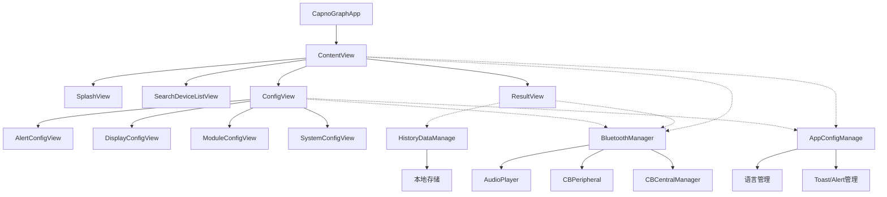
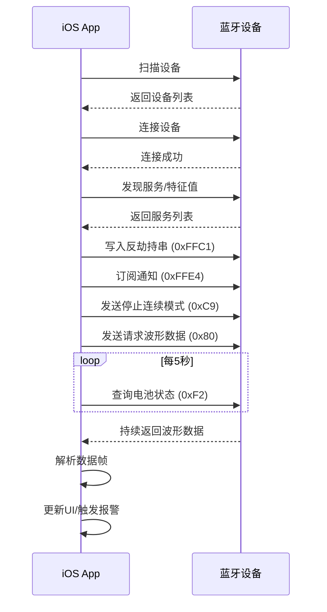

!!! info "GitNexus 自动生成"
    来源提交：`edfd024010878ede15ae0d16c58308adc8eebef7`；生成时间：`2026-07-18T16:08:03.557Z`。
    本页允许同步脚本覆盖；涉及行为判断时请回到当前源码、配置和测试核验。
# CapnoGraph iOS 应用模块

## 概述

CapnoGraph iOS 应用是一个用于连接和管理二氧化碳监测设备的移动端应用程序。该模块实现了蓝牙设备发现、连接、数据接收、参数配置、报警管理以及数据可视化等核心功能。应用采用 SwiftUI 框架构建，遵循 MVVM 架构模式。

## 核心架构

### 模块组成

```
CapnoGraph/
├── CapnoGraphApp.swift          # 应用入口
├── ContentView.swift            # 主视图容器
├── BluetoothManage.swift        # 蓝牙通信管理
├── AppConfigManage.swift        # 应用配置管理
├── HistoryDataManage.swift      # 历史数据管理
├── SplashView.swift             # 启动页
├── SearchDeviceListView.swift   # 设备搜索列表
├── ResultView.swift             # 实时数据显示
├── ConfigView.swift             # 设置主视图
├── AlertConfigView.swift        # 报警参数配置
├── DisplayConfigView.swift      # 显示参数配置
├── ModuleConfigView.swift       # 模块参数配置
├── SystemConfigView.swift       # 系统设置
└── ExtraAssets/                 # 资源文件
    ├── LowLevelAlert.wav
    └── MiddleLevelAlert.wav
```

### 架构流程图



## 关键组件详解

### 1. 蓝牙管理 (`BluetoothManage.swift`)

`BluetoothManager` 类是应用的核心通信层，负责所有蓝牙相关的操作。

#### 主要职责

- **设备发现与连接**：扫描周围蓝牙设备，建立连接
- **数据通信**：发送指令和接收波形数据
- **参数配置**：同步设备参数（报警范围、单位、刻度等）
- **状态监控**：监控电池状态、连接状态、报警状态

#### 核心协议实现

```swift
class BluetoothManager: NSObject, ObservableObject,
    CBCentralManagerDelegate, CBPeripheralDelegate {

    // 中央设备管理器
    private var centralManager: CBCentralManager!

    // 已发布属性
    @Published var discoveredPeripherals = [CBPeripheral]()
    @Published var connectedPeripheral: CBPeripheral?
    @Published var receivedCO2WavedData: [DataPoint]
    @Published var currentWavePointData: CO2WavePointData
    @Published var ETCO2: Float = 0
    @Published var RespiratoryRate: Int = 0
    @Published var isAsphyxiation: Bool = false
    @Published var CO2Unit: CO2UnitType = .mmHg
}
```

#### 指令系统

应用通过自定义协议与设备通信，定义了以下指令类型：

| 指令 | 用途 | 说明 |
|------|------|------|
| `CO2Waveform (0x80)` | 接收波形数据 | 持续接收CO2波形 |
| `Zero (0x82)` | 校零 | 传感器零点校准 |
| `Settings (0x84)` | 读写设置 | 模块参数配置 |
| `Expand (0xF2)` | 扩展指令 | 系统信息、报警配置 |
| `Reset (0xF8)` | 复位/关机 | 设备关机 |

#### 数据流处理

```swift
// 接收外设数据
func receivePeripheralData(peripheral: CBPeripheral, characteristic: CBCharacteristic) {
    guard let charValue = characteristic.value else { return }
    receivedArray.append(contentsOf: charValue)

    if receivedArray.count >= 20 {
        let firstArray = getCMDDataArray()
        getSpecificValue(firstArray: firstArray)
    }
}

// 解析数据帧
func getSpecificValue(firstArray: [UInt8]) {
    // 校验checksum
    // 根据指令类型分发处理
    switch commandM {
        case SensorCommand.CO2Waveform.rawValue:
            handleCO2Waveform(data: data, NBFM: NBFM)
        case SensorCommand.Settings.rawValue:
            handleSettings(data: data)
        // ...
    }
}
```

### 2. 应用配置管理 (`AppConfigManage.swift`)

`AppConfigManage` 类管理应用的全局状态和配置。

#### 核心功能

- **多语言支持**：中英文切换，通过 `getTextByKey(key:)` 方法获取本地化文本
- **全局状态管理**：Loading、Toast、Alert 等 UI 状态
- **设备信息存储**：固件版本、硬件版本、序列号等
- **用户偏好设置**：报警范围、显示参数等

```swift
class AppConfigManage: ObservableObject {
    @Published var language: Languages = Languages.Chinese
    @Published var loadingMessage: String = ""
    @Published var toastMessage: String = ""
    @Published var toastType: ToastType = ToastType.SUCCESS
    @Published var firmwareVersion: String = defaultDeviceInfo
    @Published var hardwareVersion: String = defaultDeviceInfo
    // ...
}
```

### 3. 报警配置视图 (`AlertConfigView.swift`)

提供 ETCO2 和 RR 报警范围的双滑块配置界面。

#### 自定义 RangeSlider

```swift
struct RangeSlider: View {
    var title: String
    @Binding var lowerValue: CGFloat
    @Binding var upperValue: CGFloat
    var range: ClosedRange<CGFloat>

    // 通过 DragGesture 实现滑块拖动
    .gesture(DragGesture().onChanged({ value in
        let newLowerValue = min(max(0, value.translation.width + lowerKnobPosition), width) / width
        lowerValue = range.lowerBound + (range.upperBound - range.lowerBound) * newLowerValue
    }))
}
```

#### 更新流程

```swift
Button("更新") {
    // 1. 验证范围有效性
    let isRangeValid = bluetoothManager.checkAlertRangeValid(...)

    // 2. 检查蓝牙状态
    let isPass = bluetoothManager.checkBluetoothStatus()

    // 3. 保存到 UserDefaults
    UserDefaults.standard.set(etCo2Lower, forKey: "etCo2Lower")

    // 4. 发送到设备
    let isSuccess = bluetoothManager.updateAlertRange(...)
}
```

### 4. 音频报警系统

`AudioPlayer` 类管理报警音频播放，支持两级报警：

- **低级报警**：技术报警（需要校零、无适配器、适配器污染）
- **中级报警**：生理报警（ETCO2异常、RR异常、窒息、低电量）

```swift
class AudioPlayer {
    var playStatus: Int = 0  // 0:不播放 1:低级 2:中级

    func playAlertAudio(type: AudioType = .MiddleLevelAlert) {
        // 14秒冷却时间，防止频繁报警
        DispatchQueue.main.asyncAfter(deadline: .now() + 14) {
            self.isReady = true
        }
    }
}
```

## 数据流与通信协议

### 蓝牙通信流程



### 数据帧格式

```
| CMD (1字节) | NBF (1字节) | DB (N字节) | CKS (1字节) |
```

- **CMD**：指令类型
- **NBF**：数据长度（不包括CMD和CKS）
- **DB**：数据体
- **CKS**：校验和（所有字节取反+1，保留低7位）

## 配置项说明

### 显示参数

| 参数 | 可选值 | 说明 |
|------|--------|------|
| CO2单位 | mmHg, %, kPa | 影响显示和报警范围 |
| CO2刻度 | Small/Middle/Large | 波形显示范围 |
| WF速度 | 1/2/4 | 波形滚动速度 |

### 报警参数

| 参数 | 默认范围 | 说明 |
|------|----------|------|
| ETCO2下限 | 0-99 (mmHg) | 低值报警阈值 |
| ETCO2上限 | 0-99 (mmHg) | 高值报警阈值 |
| RR下限 | 3-150 bpm | 呼吸率低值报警 |
| RR上限 | 3-150 bpm | 呼吸率高值报警 |

### 模块参数

| 参数 | 范围 | 默认值 |
|------|------|--------|
| 窒息时间 | 10-60秒 | 20秒 |
| 氧气补偿 | 0-100% | 16% |

## 与外部模块的交互

### 依赖关系

- **HistoryDataManage**：`BluetoothManager` 将波形数据传递给 `HistoryDataManage` 进行本地存储
- **ResultView**：订阅 `BluetoothManager` 的 `@Published` 属性实时更新显示
- **ConfigView**：通过 `BluetoothManager` 发送配置指令到设备

### 数据导出

应用支持通过 `HistoryDataManage` 将历史数据导出为 PDF 格式，包含完整的 CO2 波形记录。

## 安全机制

### 反蓝牙劫持

应用实现了反劫持机制，在连接建立后立即写入特定的反劫持字符串：

```swift
let antiHijackStr = "301001301001"
peripheral?.writeValue(antiHijackData, for: characteristic, type: .withResponse)
```

### 连接恢复

应用通过 `UserDefaults` 保存已连接设备的标识符，支持自动重连：

```swift
let savedPeripheralIdentifierKey = "SavedPeripheralIdentifier"
```

## 已知问题

1. **RangeSlider 滑块重叠**：当两个滑块值接近时，文字标签可能互相遮盖
2. **滑块越界**：右滑块可以滑动到左滑块左侧，需要增加位置限制逻辑
