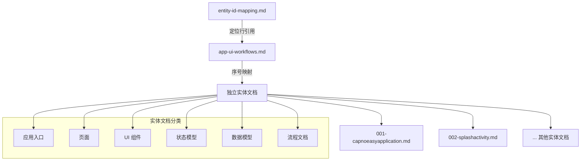

!!! info "GitNexus 自动生成"
    来源提交：`edfd024010878ede15ae0d16c58308adc8eebef7`；生成时间：`2026-07-18T16:08:03.557Z`。
    本页允许同步脚本覆盖；涉及行为判断时请回到当前源码、配置和测试核验。
# context/docs 模块 — 应用入口、页面、UI 与状态补充上下文

## 概述

`context/docs` 模块是 CapnoEasy 项目的实体级补充上下文索引系统。它为项目中所有应用入口、页面、UI 组件、状态模型、数据模型和流程提供结构化的文档化参考，确保开发者能够快速定位和理解每个实体的职责、调用关系和注意事项。

该模块的核心是一个索引文件 `app-ui-workflows.md`，它维护了从 `context/entity-id-mapping.md` 定位表到每个实体独立文档的映射关系。

## 架构设计



## 核心文件

### 1. 索引文件：`app-ui-workflows.md`

**定位入口**：`context/entity-id-mapping.md`

**职责**：
- 作为第二组任务的索引，不承载实体细节
- 维护实体与独立文档的映射表
- 提供使用规则和同步要求

**使用规则**：
1. 修改页面、组件、状态或导航前，先在 `entity-id-mapping.md` 定位实体
2. 读取该实体行的 `补充上下文`
3. 每个实体的补充上下文只维护在对应的独立文档中
4. 文档与源码不一致时，以源码为准，并同步修正对应实体文档和定位表

**映射表结构**：

| 序号 | 定位行 | 实体 | 领域 | 文档 |
|------|--------|------|------|------|
| 001 | L75 | CapnoEasyApplication | 应用入口 | `001-capnoeasyapplication.md` |
| 002 | L76 | SplashActivity | 页面 | `002-splashactivity.md` |
| ... | ... | ... | ... | ... |

### 2. 独立实体文档

每个实体对应一个独立的 Markdown 文档，位于 `context/docs/app-ui-workflows/` 目录下。

**文档模板结构**：

```markdown
# 实体名称

来源批次：[批次描述]
定位入口：`context/entity-id-mapping.md`（L行号）
领域：[领域分类]

## 实体定位
- 实体：[实体名称]
- ID / 别名：[常用别名]
- 源文件：[源文件路径]
- 原始补充上下文：[原始上下文来源]
- 备注：[简要说明]

## 补充职责
[详细职责描述]

## 关键 ID / 别名
[常用别名列表]

## 关键字段 / 方法
- 主要实体或方法：[描述]
- 直接源码入口：[源文件路径]

## 主要调用点
[调用关系描述]

## 注意事项
[重要注意事项]

## 最小验证方式
[验证方法]

## 同步要求
[同步更新要求]
```

## 实体分类

### 应用入口（Application Entry）
- **CapnoEasyApplication**：Hilt Application 入口，初始化 ErrorReporter/Bugly、数据库、备份 helper
- **App bootstrap flow**：应用启动流程，包含 Hilt、Bugly、数据库、BaseActivity 公共初始化

### 页面（Pages）
- **SplashActivity**：启动页，1.5 秒后跳转 MainActivity
- **BaseActivity**：所有业务页面基类，初始化 ViewModel、Bluetooth、Print、Storage
- **MainActivity**：主页，CO2 波形、数据表格和记录流程
- **SearchActivity**：设备搜索页，BLE 和经典蓝牙扫描/连接
- **SettingActivity**：设置入口页
- **AlertSettingActivity**：报警参数页，ETCO2/RR 范围设置
- **DisplaySettingActivity**：显示参数页，CO2 单位、量程和扫描速度
- **ModuleSettingActivity**：模块参数页，大气压、窒息时间和 O2 补偿
- **PrintSettingActivity**：打印设置页，PDF/热敏输出、水印配置
- **SystemSettingActivity**：系统设置页，语言和屏幕常亮
- **HistoryRecordsActivity**：历史列表页，按患者/日期分组
- **HistoryRecordDetailActivity**：历史详情页，图表预览、PDF 导出和打印

### UI 组件（Components）
- **BaseLayout**：页面容器，包含顶栏/底栏和全局弹层
- **ActionBar**：顶部导航栏，三个固定 Tab
- **NavBar**：底部操作栏，根据页面状态显示不同图标
- **EtCo2LineChart**：实时波形图，MPAndroidChart 包装
- **EtCo2Table**：实时数据表，ETCO2/RR/FICO2 展示
- **DeviceList**：蓝牙设备列表
- **HistoryList**：历史记录列表，支持分组
- **SettingList**：设置入口列表
- **RangeSelector**：报警范围选择器
- **WheelPicker**：滚轮选择器
- **TypeSwitch**：分段选择组件
- **ActionModal**：操作弹窗（导出/打印）
- **AlertModal**：报警弹窗
- **ConfirmModal**：确认弹窗
- **Toast**：轻提示
- **Loading**：加载遮罩
- **SaveButton**：通用保存按钮
- **CustomTextField**：自定义输入框

### 状态模型（State Models）
- **AppState**：单例状态容器，包含页面、Tab、弹层、设备、记录、设置、患者信息
- **AppStateModel**：唯一 HiltViewModel，提供 update* 函数作为状态写入口
- **NavBarComponentState**：底栏当前页面状态
- **TabItem**：顶栏标签项模型
- **Atribute**：表格属性行配置
- **Setting**：设置行模型
- **AlertData**：报警弹窗数据
- **ConfirmData**：确认弹窗数据
- **ToastData**：轻提示数据
- **LoadingData**：加载数据
- **SupportQRCodeType**：二维码辅助配置
- **CustomType**：分段类型接口
- **DeviceType**：设备类型项
- **DeviceTypeList**：设备类型枚举
- **OutputType**：输出类型（PDF/热敏）

### 数据模型（Data Models）
- **CO2WavePointData**：波形数据点，包含 co2、RR、ETCO2、FiCO2、sampleTimeMillis、index
- **DataPoint**：BLE/图表辅助数据点
- **BLEDeviceExtra**：设备元数据
- **Device**：设备列表 UI 模型

### 流程文档（Flow Documents）
- **App bootstrap flow**：应用启动流程
- **Page shell and overlays flow**：页面框架和全局弹层
- **History records flow**：历史记录流程
- **History detail chart flow**：历史详情图表流程
- **Display settings flow**：显示设置流程
- **Alert settings flow**：报警设置流程
- **Module settings flow**：模块设置流程
- **Print preferences flow**：打印偏好流程
- **System language and module info flow**：系统语言和模块信息流程

## 关键状态函数

AppStateModel 提供 40+ 个 update* 函数，覆盖以下领域：

| 领域 | 函数示例 |
|------|----------|
| 页面导航 | `updateCurrentPage`, `updateCurrentTab` |
| 全局弹层 | `updateToastData`, `updateAlertData`, `updateConfirmData`, `updateLoadingData`, `updateShowActionModal` |
| 设备管理 | `updateDevices`, `updateConnectType`, `updateDiscoveredPeripherals` |
| 记录控制 | `updateIsRecording`, `updateTotalCO2WavedData`, `delSavedCO2WavedDataChunk` |
| 报警设置 | `updateAlertETCO2Range`, `updateAlertRRRange` |
| 显示设置 | `updateCO2Unit`, `updateCO2Scale`, `updateCo2Scales`, `updateWFSpeed` |
| 模块设置 | `updateAsphyxiationTime`, `updateO2Compensation`, `updateAirPressure` |
| 系统设置 | `updateLanguage`, `updateKeepScreenOn` |
| 打印设置 | `updateIsPDF`, `updatePdfHospitalName`, `updatePdfReportName`, `updatePdfTemplateMode`, `updatePdfWatermarkEnabled`, `updatePdfWatermarkText`, `updatePdfWatermarkOpacity` |
| 患者信息 | `updatePatientName`, `updatePatientGender`, `updatePatientAge`, `updatePatientID`, `updatePatientDepartment`, `updatePatientBedNumber` |
| 其他 | `updateShowTrendingChart`, `clearXData` |

## 与代码库的连接

### 数据流

```
用户操作 → Activity/Component → AppStateModel.update*() → AppState → UI 重组
```

### 蓝牙数据流

```
BlueToothKit.dataFlow → EtCo2LineChart（实时波形）
BlueToothKit.dataFlow → AppStateModel.updateTotalCO2WavedData（记录缓存）→ Room（持久化）
```

### 设置保存流

```
设置页面 → AppStateModel.update*() → SharedPreferences（本地持久化）
设置页面 → BlueToothKit.update*() → 设备（实时同步）
```

## 注意事项

1. **文档同步**：所有实体文档必须与 `entity-id-mapping.md` 保持同步，修改源码后需更新对应文档
2. **错误上报**：BaseActivity 会将当前页面和 Activity 写入错误上报上下文，但不直接携带患者敏感信息
3. **PDF 导出**：当前 PDF 导出固定按 15 秒连续波形切段，不再使用异常上下文秒数设置
4. **水印配置**：正式模板默认关闭水印，调试模板默认启用水印，用户保存的开关会覆盖模板默认值
5. **数据模型**：`CO2WavePointData` 的 `sampleTimeMillis` 为采样到达时的 epoch millis，旧记录缺失时回退到 `record.startTime + index / POINTS_PER_SECOND`
6. **类名拼写**：`Atribute` 类名当前拼写为 `Atribute`（非 `Attribute`），修改时需同步更新所有引用

## 验证方式

- **编译验证**：`./gradlew :app:assembleDebug`
- **功能验证**：人工打开对应 Activity 流程
- **引用验证**：`rg 函数名` 确认调用点和状态副作用
- **常量验证**：`rg 常量名` 确认所有引用
