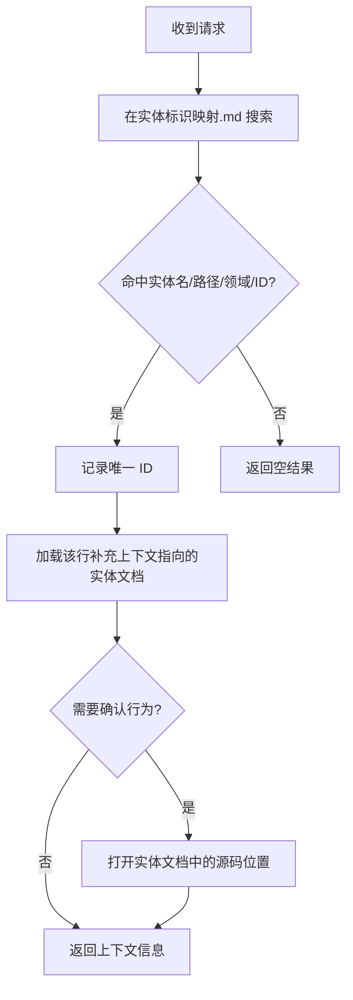

!!! info "GitNexus 自动生成"
    来源提交：`edfd024010878ede15ae0d16c58308adc8eebef7`；生成时间：`2026-07-18T16:08:03.557Z`。
    本页允许同步脚本覆盖；涉及行为判断时请回到当前源码、配置和测试核验。
# context — 文档 模块

## 概述

`context/文档/` 模块是项目的实体上下文管理系统，为 AI Agent 和开发者提供轻量级的符号定位与上下文加载能力。它通过短 ID 映射、实体文档和加载流程，实现按需获取代码符号的上下文信息，避免全量加载带来的性能开销。

## 核心架构

### 目录结构

```
context/文档/
├── 代码库上下文.md          # 仓库级总览与加载流程
├── 实体标识映射.md          # 实体名/路径/ID → 实体文档的映射表
└── 实体/                    # 实体上下文文档目录
    ├── CL-ACM.md            # AppConfigManage
    ├── CL-AP.md             # AudioPlayer
    ├── EN-AT.md             # AudioType
    ├── FN-AC.md             # appendCKS
    ├── ST-ACV.md            # AlertConfigView
    └── ...                  # 共 80 个实体文档
```

### 实体文档结构

每个实体文档遵循统一的 `context-seed` 格式，包含以下部分：

```markdown
<!-- context-seed:start -->
# 实体名称

## 定位

- ID: `CL-ACM`              # 唯一短 ID
- 类型: `class`             # 符号类型 (class/enum/function/struct)
- 领域: `apps`              # 所属领域
- 来源: `apps/ios/CapnoGraph/AppConfigManage.swift:239`  # 源码位置
- 实体映射: `context/实体标识映射.md`

## 上下文

- 简要描述实体的类型、位置和归属领域。
- 处理同名功能、调用关系、重构或测试失败时，先打开来源位置确认实现。

## 使用建议

- 当请求命中本 ID、实体名、来源路径或领域时加载本文件。
- 本文件用于快速定向；实现或修复前仍需打开来源文件验证当前行为。
- 如果实体移动、重命名或语义变化，同步更新本文件和实体映射。
<!-- context-seed:end -->
```

### ID 命名规范

实体 ID 采用 `前缀-短名称` 格式，前缀表示符号类型：

| 前缀 | 类型 | 示例 |
|------|------|------|
| `CL-` | class | `CL-ACM` (AppConfigManage) |
| `EN-` | enum | `EN-AT` (AudioType) |
| `FN-` | function | `FN-AC` (appendCKS) |
| `ST-` | struct | `ST-ACV` (AlertConfigView) |

## 上下文加载流程



### 加载规则

1. **搜索范围**：在 `context/实体标识映射.md` 中搜索实体名、文件路径、领域词或 ID。
2. **去重**：只记录命中的唯一 ID，避免重复加载。
3. **按需加载**：仅加载映射行中 `补充上下文` 指向的实体文档。
4. **延迟验证**：需要确认行为时，再打开实体文档中的源码位置。

## 关键组件

### 1. 代码库上下文 (`代码库上下文.md`)

仓库级总览文件，包含：
- 源码与配置概览（目录结构、文件扩展名统计）
- 实体上下文数量（当前 80 个）
- 上下文加载流程说明
- 工作指引（修改前解析名称、AI Agent 调用流程、交叉验证要求）
- 最近提交影响记录

### 2. 实体标识映射 (`实体标识映射.md`)

核心索引文件，将实体名、文件路径、领域词和 ID 映射到对应的实体文档。是上下文加载的入口点。

### 3. 实体文档 (`实体/` 目录)

每个实体一个文件，提供：
- **定位信息**：ID、类型、领域、源码位置
- **上下文描述**：实体的基本属性和使用注意事项
- **使用建议**：何时加载、如何验证、同步更新要求

## 实体分布

当前系统管理 80 个实体上下文，主要分布在两个领域：

### apps 领域（iOS 应用）

集中在两个源文件中：

- **BluetoothManage.swift**：蓝牙管理相关实体
  - 类：`BluetoothManager`, `AudioPlayer`
  - 枚举：`SensorCommand`, `BLEServerUUID`, `BLECharacteristicUUID`, `BLEDescriptorUUID`, `ZSBState`, `ISBState80H`, `ISBState84H`, `ISBStateF2H`, `ISBStateCAH`, `ISBState`, `AudioType`
  - 函数：`appendCKS`, `calculateCKS`, `characteristicStateUpdate`, `checkAlertRangeValid`, `checkBluetoothStatus`, `connect`, `convertToData`, `correctZero`, `disconnect`, `getCMDDataArray`, `getDeviceInfo`, `getSpecificValue`, `handleCO2Status`, `handleCO2Waveform`, `handleSettings`, `handleSofrWareVersion`, `handleSystemExpand`, `initDevice`, `keepScreenOn`, `playAlertAudio`, `receivePeripheralData`, `registerCharacteristic`, `registerService`, `resetInstance`, `resetSendData`, `sendContinuous`, `sendStopContinuous`, `shutdown`, `silent`, `startScanning`, `stopAudio`, `stopScanning`, `updateAlertRange`, `updateCO2Unit`, `updateDisplayParams`, `updateNoBreathAndGasCompensation`

- **AppConfigManage.swift**：应用配置管理相关实体
  - 类：`AppConfigManage`
  - 枚举：`Languages`, `CO2UnitType`, `CO2ScaleEnum`, `WFSpeedEnum`, `AppTextsChinese`, `AppTextsEnglish`, `LocalizedText`
  - 函数：`getTextByKey`, `listenToBluetoothManager`

- **AlertConfigView.swift**：告警配置视图
  - 结构体：`RangeSlider`, `AlertConfigView`
  - 函数：`calculateOffsetX`

### .omp 领域（项目工具）

集中在 `.omp/tools/capno-project.js` 中：

- 函数：`cleanCell`, `splitCellValues`, `unique`, `pathExists`, `normalizeProjectPath`, `parseRgLine`, `formatLookupResult`, `factory`

## 工作指引

### 开发者操作流程

1. **修改前**：通过 `context/实体标识映射.md` 解析名称，定位相关实体。
2. **AI Agent 调用**：使用 `python -m context_seed prepare . --operation init --json`，按 `ai_tasks` 顺序逐个补充实体上下文，审阅计划后再 `apply`。
3. **行为变更前**：将实体上下文与源码文件交叉验证，确保理解正确。
4. **修改后**：只更新相关实体上下文和映射行，按需刷新可选图索引。

### 维护规则

- 实体移动、重命名或语义变化时，同步更新实体文档和实体标识映射。
- 实体文档用于快速定向，实现或修复前仍需打开来源文件验证当前行为。
- 最近提交影响记录在 `代码库上下文.md` 中维护，反映配置、上下文和技能变更。
