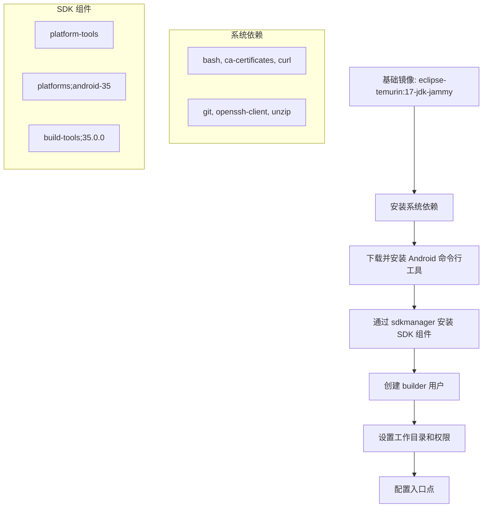

!!! info "GitNexus 自动生成"
    来源提交：`edfd024010878ede15ae0d16c58308adc8eebef7`；生成时间：`2026-07-18T16:08:03.557Z`。
    本页允许同步脚本覆盖；涉及行为判断时请回到当前源码、配置和测试核验。
# Docker 模块

## 概述

`docker` 模块提供 CapnoGraph 项目的容器化构建环境，主要包含 Android 构建镜像。该模块的核心目标是提供一个可复现、与开发环境无关的 Android 构建环境，确保 CI/CD 流水线和本地开发使用完全相同的工具链。

## Android Builder 镜像

### 镜像结构

镜像基于 `eclipse-temurin:17-jdk-jammy`，预装了完整的 Android 开发工具链：

- **JDK**: Eclipse Temurin 17 (LTS)
- **Android SDK**: 平台 `android-35`，构建工具 `35.0.0`
- **命令行工具**: 版本 `13114758`
- **Gradle**: 由项目 wrapper 驱动，当前版本 `8.10.2`
- **Android Gradle Plugin**: 项目依赖，当前版本 `8.8.0`
- **Kotlin**: 项目依赖，当前版本 `2.0.0`

### 构建流程



### 关键设计决策

1. **不包含项目源代码**: 镜像仅提供构建环境，项目代码在运行时通过卷挂载。这保证了镜像的通用性和缓存效率。

2. **使用 builder 用户**: 创建非 root 用户 `builder` (UID 1000)，避免以 root 权限运行构建，提高安全性。

3. **Gradle 用户主目录持久化**: 通过 `GRADLE_USER_HOME` 环境变量指定缓存路径，支持 Docker 卷持久化 Gradle 缓存，加速后续构建。

4. **Hilt 插件映射**: Android Gradle 配置显式将 Hilt 插件 ID 映射到 `com.google.dagger:hilt-android-gradle-plugin`，确保在干净的 Docker/CI 环境中能够正确解析插件。

## 使用方式

### Docker Compose（推荐）

项目根目录的 `compose.yaml` 已将此镜像声明为 `android-builder` 服务：

```bash
docker compose run --rm android-builder scripts/package.sh --target android --variant debug -- --no-daemon
```

### Docker 直接运行

调试构建：
```bash
docker run --rm \
  -v "$PWD:/workspace" \
  -v capnograph-gradle-cache:/home/builder/.gradle \
  -w /workspace \
  wei123098/capnograph-android-builder:android-35-agp-8.8.0 \
  'scripts/package.sh --target android --variant debug -- --no-daemon'
```

发布构建：
```bash
docker run --rm \
  -v "$PWD:/workspace" \
  -v capnograph-gradle-cache:/home/builder/.gradle \
  -w /workspace \
  wei123098/capnograph-android-builder:android-35-agp-8.8.0 \
  'scripts/package.sh --target android --variant release -- --no-daemon'
```

### 参数说明

- `-v "$PWD:/workspace"`: 挂载项目根目录到容器工作目录
- `-v capnograph-gradle-cache:/home/builder/.gradle`: 持久化 Gradle 缓存
- `-w /workspace`: 设置工作目录
- 入口点 `["/bin/bash", "-lc"]`: 允许执行 shell 命令

## 与项目其他部分的连接

- **`apps/android`**: 该镜像专门为 Android 应用模块提供构建环境
- **`scripts/package.sh`**: 构建脚本，通过入口点调用
- **`compose.yaml`**: 项目根目录的 Docker Compose 配置引用此镜像

## 注意事项

1. **发布签名**: 当前 Android 项目未定义发布签名配置。在生产环境中使用此镜像进行 APK/AAB 签名前，需要在 Gradle 中添加环境驱动的签名配置。

2. **镜像标签**: 使用 `android-35-agp-8.8.0` 标签，明确标识 SDK 平台和 AGP 版本，便于版本管理。

3. **缓存策略**: 建议使用命名卷 `capnograph-gradle-cache` 持久化 Gradle 缓存，避免每次构建都重新下载依赖。
