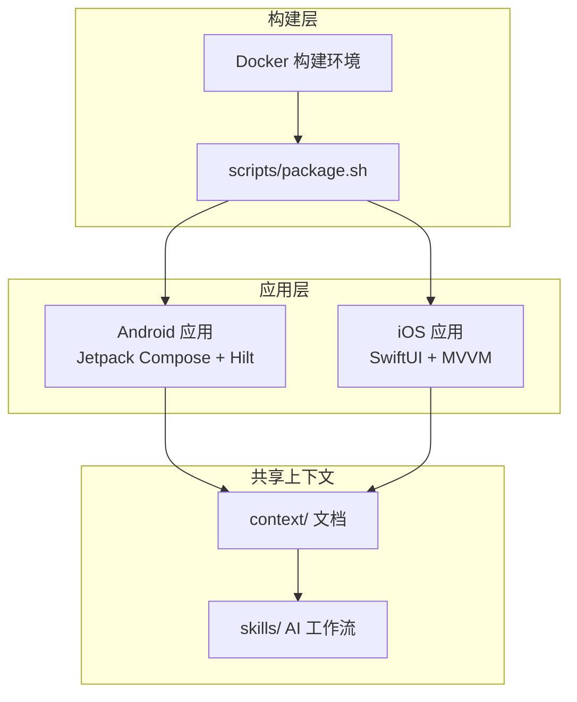

!!! info "GitNexus 自动生成"
    来源提交：`edfd024010878ede15ae0d16c58308adc8eebef7`；生成时间：`2026-07-18T16:08:03.557Z`。
    本页允许同步脚本覆盖；涉及行为判断时请回到当前源码、配置和测试核验。
# CapnoGraph Monorepo 概览

## 项目简介

CapnoGraph 是一个跨平台的二氧化碳监测设备配套应用，为医疗级二氧化碳监测仪提供移动端控制与数据管理功能。本项目采用 monorepo 架构，将 Android 和 iOS 两个平台的原生应用整合在同一个仓库中，共享项目上下文和 AI 辅助开发工作流。

## 架构总览



## 核心模块

### 应用层

[apps](apps.md) 模块包含两个平台的原生应用，它们在功能上互为镜像：

- **[Android 应用](apps-android.md)**：基于 Jetpack Compose + Material3 构建，使用 Hilt 依赖注入、Room 本地存储和 MPAndroidChart 图表库
- **[iOS 应用](apps-ios.md)**：基于 SwiftUI 构建，遵循 MVVM 架构模式

两个应用均实现蓝牙设备管理、实时 CO₂ 波形展示、报警阈值配置、历史数据持久化和 PDF 报告导出等核心功能。

### 构建与部署

- **[scripts](scripts.md)** 模块提供统一的打包入口 `package.sh`，通过 `--target` 和 `--variant` 参数选择平台和构建类型
- **[docker](docker.md)** 模块提供基于 Eclipse Temurin 17 的 Android 构建镜像，确保 CI/CD 环境与本地开发一致

### AI 辅助开发

- **[context](context.md)** 模块维护项目实体的上下文文档系统，通过短 ID 映射实现按需加载
- **[skills](skills.md)** 模块定义上下文感知开发流程，确保 AI Agent 始终基于项目实际状态进行操作

### 专题知识

- **[专题知识手册](../../index.md)**：按产品、业务和研发任务组织的阅读入口
- **[业务领域与端到端流程](../../business/domain-and-workflows.md)**：业务术语、参与者、监测/记录/报告流程和数据不变量
- **[Android 架构](../../architecture/android-architecture.md)**：Activity/Compose、全局状态、BLE Kit、Room 与输出链路
- **[iOS 架构](../../architecture/ios-architecture.md)**：SwiftUI、EnvironmentObject、CoreBluetooth、内存历史与 PDF 链路
- **[数据对象与业务风险](../../business/data-and-risks.md)**：对象不变量、患者数据边界和当前待确认项

## 关键工作流

### 蓝牙连接与数据初始化

这是应用启动时的核心流程，跨越多个模块协同工作：

1. `BlueToothKit.initCapnoEasyConection` 发起蓝牙连接
2. 通过 `BlueToothTaskQueueKit` 的任务队列依次执行数据收发
3. 错误信息经由 `ErrorReporter` 处理，包含键值清洗（`sanitizeKey`/`sanitizeValue`）和限流（`isThrottled`）机制

### 实时数据接收

当蓝牙特征值发生变化时：

1. `onCharacteristicChanged` 接收原始数据
2. `getSpecificValue` 解析特定参数
3. `handleCO2Waveform` 处理 CO₂ 波形数据
4. 必要时通过 `AlertAudioKit.stopAudio` 控制报警音频

## 快速开始

### 环境要求

- **Android**: JDK 17, Android SDK 35
- **iOS**: Xcode 15+, macOS
- **Docker**（可选）: 用于容器化构建

### 构建命令

```bash
# Android 调试包
scripts/package.sh --target android --variant debug

# Android 发布包（禁用 Gradle 守护进程）
scripts/package.sh --target android --variant release -- --no-daemon

# iOS 调试包
scripts/package.sh --target ios --variant debug

# 使用 Docker 构建 Android
docker build -t capnograph-builder docker/android/
docker run --rm -v $(pwd):/workspace capnograph-builder \
  bash -c "cd /workspace && scripts/package.sh --target android --variant debug"
```

## 下一步

- 先阅读 [专题知识手册](../../index.md)，按角色进入业务、技术或代码模块
- 阅读 [apps](apps.md) 了解各平台应用的详细架构
- 查看 [scripts](scripts.md) 获取完整的打包参数说明
- 参考 [skills](skills.md) 了解 AI 辅助开发的最佳实践
