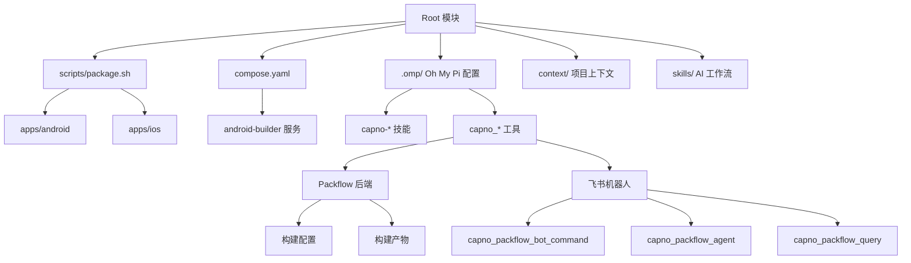

!!! info "GitNexus 自动生成"
    来源提交：`edfd024010878ede15ae0d16c58308adc8eebef7`；生成时间：`2026-07-18T16:08:03.557Z`。
    本页允许同步脚本覆盖；涉及行为判断时请回到当前源码、配置和测试核验。
# Root 模块

## 概述

Root 模块是 CapnoGraph 项目的根目录，负责定义项目的整体结构、构建流程、开发工具链和 AI 辅助工作流。它不包含业务逻辑代码，而是作为项目骨架，协调 Android 和 iOS 两个平台子模块的构建、打包和上下文管理。

## 项目结构

```
.
├── apps/
│   ├── android/        # Android Gradle 项目
│   └── ios/            # iOS Xcode 项目
├── .omp/               # Oh My Pi 项目技能、工具和提示扩展
├── context/            # AI 可读的项目上下文
├── scripts/
│   └── package.sh      # 基于目标的打包封装脚本
└── skills/             # AI 工作流指令
```

## 核心职责

### 1. 构建与打包编排

`scripts/package.sh` 是统一的打包入口，通过 `--target` 和 `--variant` 参数选择平台和构建类型：

```bash
# Android 调试包
scripts/package.sh --target android --variant debug

# Android 发布包（使用 Docker 构建器）
docker compose run --rm android-builder scripts/package.sh --target android --variant release -- --no-daemon

# iOS 发布归档
scripts/package.sh --target ios --variant release --export-options-plist ExportOptions.plist
```

Android 构建在 `apps/android` 目录下执行，iOS 构建在 `apps/ios` 目录下执行。iOS 的 DerivedData 被重定向到 `apps/ios/build/DerivedData`，避免依赖用户特定的 DerivedData 位置。

### 2. Docker 构建环境

`compose.yaml` 定义了 Android 构建服务：

- **镜像**: `wei123098/capnograph-android-builder:android-35-agp-8.8.0`
- **平台**: `linux/amd64`
- **工作目录**: `/workspace`
- **卷挂载**: 项目源码和 Gradle 缓存
- **默认命令**: 执行 `scripts/package.sh --target android --variant debug -- --no-daemon`

Gradle 缓存通过命名卷 `capnograph-gradle-cache` 持久化，加速后续构建。

### 3. AI 辅助工作流

#### 上下文种子工作流

`AGENTS.md` 定义了 `context-seed` 上下文工作流，AI Agent 处理项目时应遵循的流程：

1. **初始化阶段**: 生成计划文件
   ```bash
   python -m context_seed prepare . --operation init --json > context-seed-plan.json
   ```

2. **执行阶段**: 按计划处理实体，补充上下文文档
   - 读取 `context-seed-plan.json`
   - 按 `ai_tasks` 顺序处理实体
   - 补充 `context/文档/实体/<id>.md`
   - 只修改 `planned_files[].content`

3. **应用阶段**: 应用计划
   ```bash
   python -m context_seed apply . --plan-file context-seed-plan.json
   ```

4. **提交后收尾**: 同步上下文
   ```bash
   python -m context_seed prepare . --operation finalize --commit HEAD --json > context-seed-plan.json
   python -m context_seed apply . --plan-file context-seed-plan.json
   ```

#### Oh My Pi 集成

`.omp/` 目录包含 Oh My Pi 项目配置，提供以下技能和工具：

**技能**:
- `capno-context`: 上下文管理
- `capno-android`: Android 开发支持
- `capno-ios-parity`: iOS 平台支持
- `capno-packaging`: 打包流程
- `capno-packflow`: Packflow 集成

**工具**:
- `capno_context_lookup`: 实体/上下文查询
- `capno_package`: 打包命令预览/执行
- `capno_packflow_bot_command`: 飞书文本命令路由
- `capno_packflow_agent`: Packflow 后端 AI 构建 + 产物收集 + 飞书通知
- `capno_packflow_query`: Packflow 配置/历史/详情查询
- `capno_packflow`: 本地构建工作流 + 产物收集 + 飞书通知
- `capno_feishu_send`: 手动飞书消息发送

### 4. Packflow 集成

项目注册了 Packflow 后端（`http://localhost:3001`），项目名为 `CapnoGraph`。

**构建配置**:

| 配置 | 工作目录 | 构建命令 | 产物路径 |
| --- | --- | --- | --- |
| Android Release APK | `.` | `docker compose run --rm android-builder scripts/package.sh --target android --variant release -- --no-daemon` | `apps/android/app/build/outputs/apk/release/*.apk` |
| Android Debug APK | `.` | `docker compose run --rm android-builder scripts/package.sh --target android --variant debug -- --no-daemon` | `apps/android/app/build/outputs/apk/debug/*.apk` |
| iOS Release Archive | `.` | `scripts/package.sh --target ios --variant release` | `apps/ios/build/*.xcarchive/**` |

**飞书机器人命令**:

| 飞书文本 | 路由动作 |
| --- | --- |
| `打包`, `打 APK`, `打 Android 包` | 启动 Android Debug APK 构建 |
| `打包状态`, `最新打包` | 显示最新构建状态 |
| `打包历史`, `最近 10 条打包` | 显示构建历史 |
| `打包详情 <buildId>` | 显示单个构建详情 |
| `打包配置` | 显示 Packflow 配置 |
| `打包帮助` | 显示支持的命令 |
| `打 release 包` | 警告 release 构建不可用 |

## 版本与依赖

### Android
- **Gradle 包装器**: `apps/android/gradle/wrapper/gradle-wrapper.properties`
- **Docker 构建器镜像**: `wei123098/capnograph-android-builder:android-35-agp-8.8.0`
- **Android Gradle 插件**: `8.8.0`
- **Kotlin**: `2.0.0`
- **SDK**: `compileSdk 35`, `minSdk 30`, `targetSdk 35`
- **应用版本**: `versionCode 3`, `versionName 1.2`
- **Java 字节码目标**: `11`

### iOS
- **Xcode 项目**: `apps/ios/CapnoGraph.xcodeproj`
- **Scheme**: `CapnoGraph`
- **Bundle 标识符**: `WLD.CapnoEasy`
- **应用版本**: `MARKETING_VERSION 1.0.0`, `CURRENT_PROJECT_VERSION 1`
- **部署目标**: iOS `17.0`
- **签名团队**: `WMK2N92G85`

## 架构风险与治理

`架构问题分析.md` 总结了当前架构的主要风险，按优先级排序：

### 高风险问题
1. **Android 核心职责过度集中**: `BlueToothKit`、`PDFKit`、`LocalStorageKit`、`AppStateModel` 等类承担过多职责
2. **依赖注入名义存在，实际大量全局单例**: 多个 Manager 持有全局对象
3. **状态模型过大且混入 UI 引用**: `AppStateModel` 包含 UI 控件引用
4. **异步任务和生命周期绑定不足**: 使用 `GlobalScope`、`AsyncTask`、`runBlocking`
5. **BLE 协议层缺少显式状态机**: 协议解析和状态管理耦合
6. **权限和发布合规策略偏粗**: 声明过多权限，备份策略不完善
7. **数据库备份/恢复链路半完成**: 启动时直接调用备份，恢复流程不完整

### 中风险问题
8. **iOS 与 Android 是平行实现，缺少共享协议基准**
9. **iOS 管理类和文案系统过大**
10. **构建依赖和模块边界不干净**
11. **生产调试输出较多**
12. **测试覆盖不足**

### 建议治理顺序
1. 建立最小安全网：BLE 协议解析测试、Room migration 测试、PDF 分段测试
2. Android 拆分 `BlueToothKit`：提纯协议解析和状态机
3. 收敛 `AppStateModel`：按业务域拆分状态
4. 重做备份/恢复策略
5. 建立跨平台协议样例
6. 清理发布风险
7. 拆分 PDF 和打印
8. 清理依赖

## 架构图



## 开发指南

### 本地开发
- 从项目根目录启动 `omp`，或使用 `omp --cwd <项目路径>`
- 平台本地工具放在各自 `apps/` 目录下
- 仓库级自动化通过显式参数调用 `apps/android` 或 `apps/ios`

### 打包
- 使用 `scripts/package.sh` 进行统一打包
- Android 调试包约 105MB，超过飞书文件上传限制，使用 Packflow 公共下载链接
- 发布包（release）在 R8/minify 阶段仍不稳定

### 环境变量
- `CAPNOGRAPH_OMP_BOT_WEBHOOK_URL`: 飞书机器人 webhook URL
- `CAPNOGRAPH_OMP_BOT_WEBHOOK_SECRET`: 飞书机器人签名密钥
- `CAPNOGRAPH_PACKFLOW_PUBLIC_BASE_URL`: Packflow 公共访问地址
- `CAPNOGRAPH_PACKFLOW_PUBLIC_DOWNLOAD_SECRET`: 公共下载密钥
- 不要提交 webhook URL 或密钥到仓库
