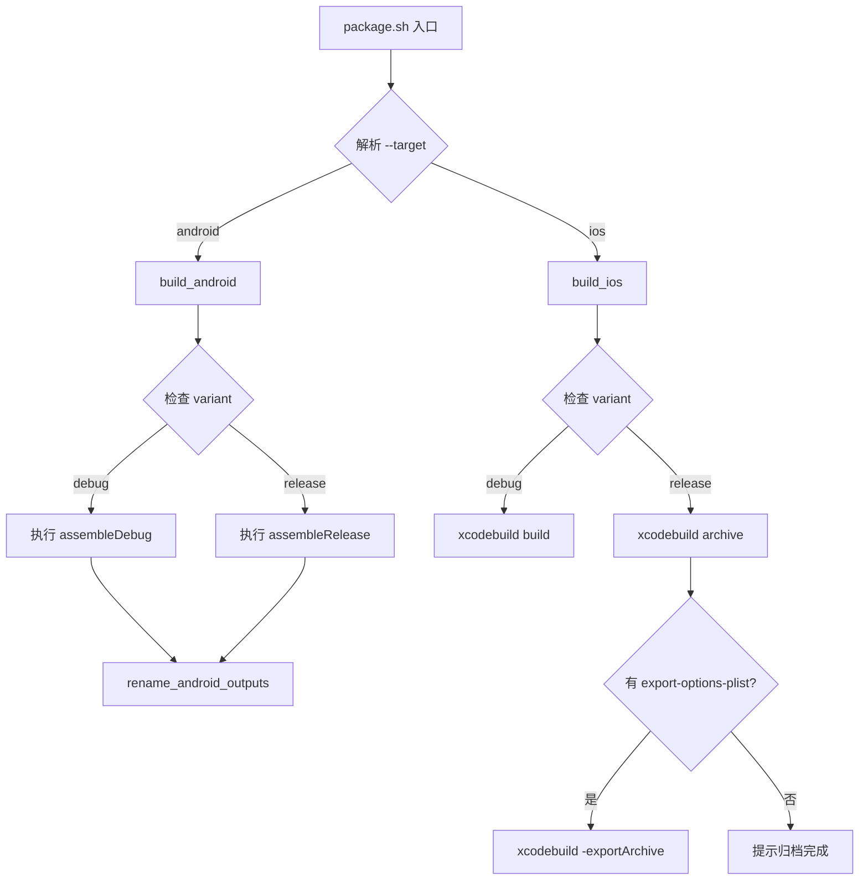

!!! info "GitNexus 自动生成"
    来源提交：`edfd024010878ede15ae0d16c58308adc8eebef7`；生成时间：`2026-07-18T16:08:03.557Z`。
    本页允许同步脚本覆盖；涉及行为判断时请回到当前源码、配置和测试核验。
# scripts 模块

## 概述

`scripts` 模块是 CapnoGraph 项目的构建打包脚本集合，提供统一的命令行接口来构建 Android 和 iOS 应用。该模块封装了 Gradle 和 xcodebuild 的调用细节，并自动处理产物重命名、版本号注入等构建流程。

## 核心脚本：`package.sh`

### 用途

`package.sh` 是一个 Bash 脚本，用于自动化 CapnoGraph 应用的构建和打包流程。它支持两种目标平台（Android 和 iOS），并针对调试（debug）和发布（release）两种变体提供不同的构建策略。

### 命令行接口

```
scripts/package.sh --target android [--variant debug|release] [-- ...extra gradle args]
scripts/package.sh --target ios [--variant debug|release] [--scheme CapnoGraph] [--configuration Debug|Release]
```

**必需参数：**
- `--target`：构建目标，可选 `android` 或 `ios`

**可选参数：**
- `--variant`：构建变体，默认 `debug`
- `--scheme`：iOS 工程 scheme，默认 `CapnoGraph`
- `--configuration`：iOS 构建配置，默认根据 variant 自动选择 Debug/Release
- `--destination`：iOS xcodebuild 目标设备
- `--archive-path`：iOS 归档路径（release 构建）
- `--export-options-plist`：导出 IPA 所需的 ExportOptions.plist
- `--export-path`：IPA 导出路径，默认 `apps/ios/build/export`
- `--derived-data-path`：iOS DerivedData 路径，默认 `apps/ios/build/DerivedData`
- `--`：分隔符，后续参数直接传递给 Gradle 或 xcodebuild

### 构建流程



### Android 构建详解

**构建命令映射：**
- debug 变体 → `./gradlew :app:assembleDebug`
- release 变体 → `./gradlew :app:assembleRelease`

**产物重命名：**
构建完成后，`rename_android_outputs` 函数会扫描 `apps/android/app/build/outputs/apk/<variant>/` 目录下的所有 APK 文件，并按照以下格式重命名：

```
<原文件名>-v<版本号>-<时间戳>.apk
```

版本号从 `apps/android/app/build.gradle.kts` 中的 `appVersionName` 变量提取。时间戳格式为 `YYYYMMDD-HHMMSS`，时区可通过环境变量 `PACKFLOW_ARTIFACT_TZ` 配置（默认 Asia/Shanghai），也可通过 `PACKFLOW_ARTIFACT_TIMESTAMP` 直接指定。

### iOS 构建详解

**构建命令映射：**
- debug 变体 → `xcodebuild build`，默认目标为 `generic/platform=iOS Simulator`
- release 变体 → `xcodebuild archive`，默认目标为 `generic/platform=iOS`

**release 构建的额外步骤：**
1. 创建 `.xcarchive` 归档文件（默认路径：`apps/ios/build/<scheme>.xcarchive`）
2. 如果提供了 `--export-options-plist`，则自动执行 `xcodebuild -exportArchive` 导出 IPA
3. 如果没有提供导出选项，则仅提示归档完成，由用户手动导出

### 环境变量

| 变量名 | 用途 | 默认值 |
|--------|------|--------|
| `PACKFLOW_ARTIFACT_TIMESTAMP` | 覆盖产物时间戳 | 当前时间 |
| `PACKFLOW_ARTIFACT_TZ` | 时间戳时区 | `Asia/Shanghai` |

## 与代码库的集成

### 目录结构

```
scripts/
└── package.sh          # 主打包脚本

apps/
├── android/
│   └── app/
│       ├── build.gradle.kts    # 包含 appVersionName 定义
│       └── build/outputs/apk/  # APK 输出目录
└── ios/
    ├── CapnoGraph.xcodeproj    # Xcode 工程文件
    └── build/                  # 构建产物目录
        ├── DerivedData/
        └── export/
```

### 调用方式

该脚本通常由 CI/CD 系统或开发者在本地手动调用。它不依赖其他模块，也不被其他模块直接调用，是一个独立的构建入口点。

### 典型使用场景

1. **本地调试构建：**
   ```bash
   scripts/package.sh --target android --variant debug
   scripts/package.sh --target ios --variant debug
   ```

2. **发布构建：**
   ```bash
   scripts/package.sh --target android --variant release -- --no-daemon
   scripts/package.sh --target ios --variant release --export-options-plist ExportOptions.plist
   ```

3. **自定义构建参数：**
   ```bash
   scripts/package.sh --target ios --variant debug --destination "platform=iOS Simulator,name=iPhone 14"
   ```

## 注意事项

1. **Android 版本号提取：** 脚本通过 awk 解析 `build.gradle.kts` 中的 `appVersionName` 变量，如果格式不符合预期（例如使用双引号以外的引号），版本号会回退为 `unknown`。

2. **iOS 导出选项：** release 构建的 IPA 导出需要提供有效的 `ExportOptions.plist`，该文件通常包含团队 ID、导出方法（app-store/ad-hoc）等信息。

3. **错误处理：** 脚本使用 `set -euo pipefail` 确保任何命令失败都会立即终止，避免产生不完整的构建产物。

4. **跨平台兼容性：** 脚本在 macOS 和 Linux 环境下均可运行，但 iOS 构建部分仅在 macOS 上有效。
