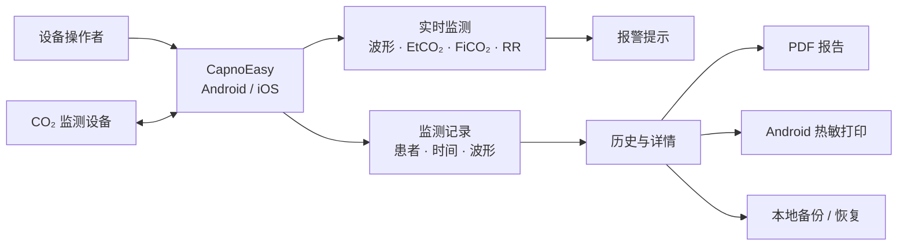
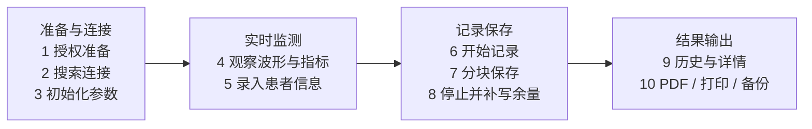
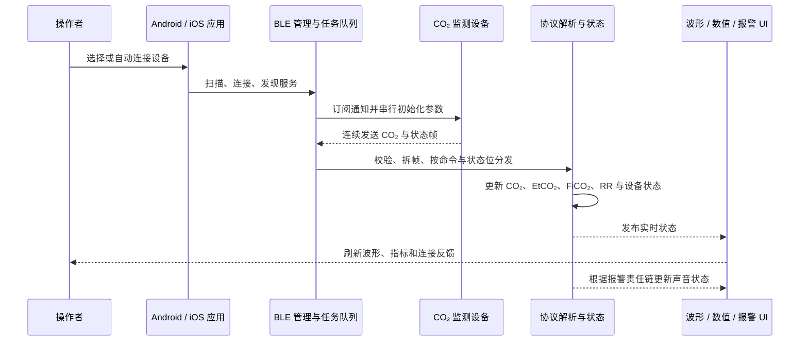
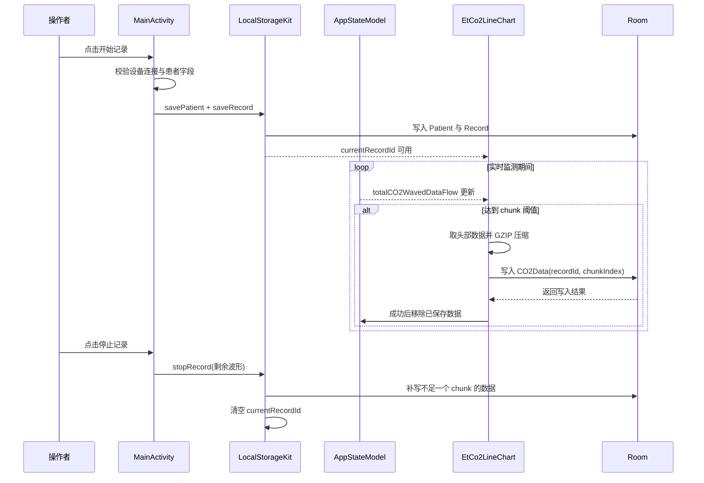

# CapnoEasy 五分钟图解导览

阅读时间：约 5 分钟适合：新成员、评审人、交付人员证据：当前分支源码

!!! abstract "先建立共同认识"
    CapnoEasy 是连接二氧化碳监测设备与移动端工作流的双平台应用。它接收设备数据、呈现实时波形和指标、执行报警提示、保存监测记录，并将同一份记录用于历史、报告和输出。

## 一张图看懂产品边界

<figure class="wiki-diagram wiki-diagram--wide" markdown>

<figcaption><strong>文字摘要：</strong>操作者通过应用连接设备，实时状态进入报警和记录，记录再进入历史、PDF、打印和备份；这不证明临床适应证或法规状态。</figcaption>
</figure>

## 一次完整业务旅程

<figure class="wiki-diagram wiki-diagram--wide" markdown>

<figcaption><strong>文字摘要：</strong>一次旅程依次经过准备连接、实时监测、记录保存和结果输出；异常路径在审核手册展开。</figcaption>
</figure>

## 实时数据如何到达屏幕

<figure class="wiki-diagram wiki-diagram--wide" markdown>

<figcaption><strong>文字摘要：</strong>设备通知经 BLE、协议和状态层进入 UI 与报警；Android/iOS 都应保持相同字段语义。</figcaption>
</figure>

## 一次记录如何落到本地

<figure class="wiki-diagram wiki-diagram--wide" markdown>

<figcaption><strong>文字摘要：</strong>Android 创建记录后按阈值写入 chunk，停止时补写余量；`Record.endTime` 的停止更新仍是 P0 待确认项。</figcaption>
</figure>

## 接下来读什么

产品、临床业务、交付

从[业务领域与端到端流程](../business/domain-and-workflows.md)继续，理解术语、参与者、报警责任链和数据不变量。

Android、iOS、架构

从[架构总览与数据契约](../architecture/technical-architecture.md)继续，再按需进入 BLE 或持久化专题。

评审、测试、质量、发布

从[审核总览与发布门禁](../review/review-guide.md)继续，再进入清单、故障、患者数据或发布证据专题。

