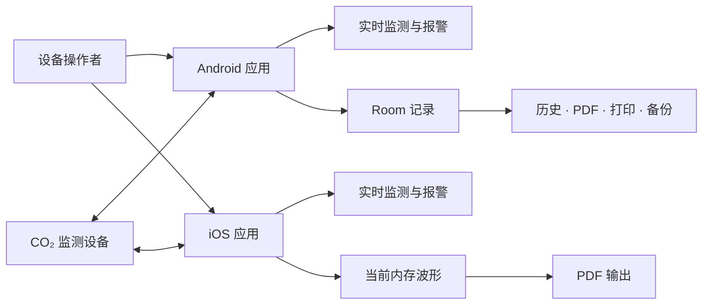
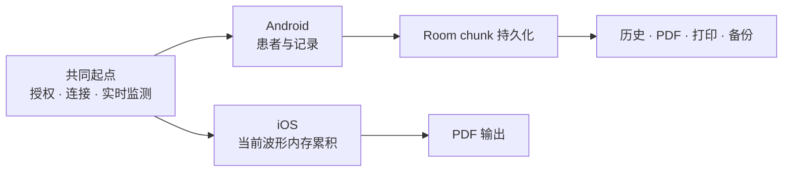
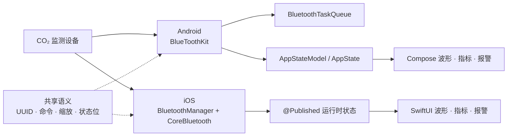
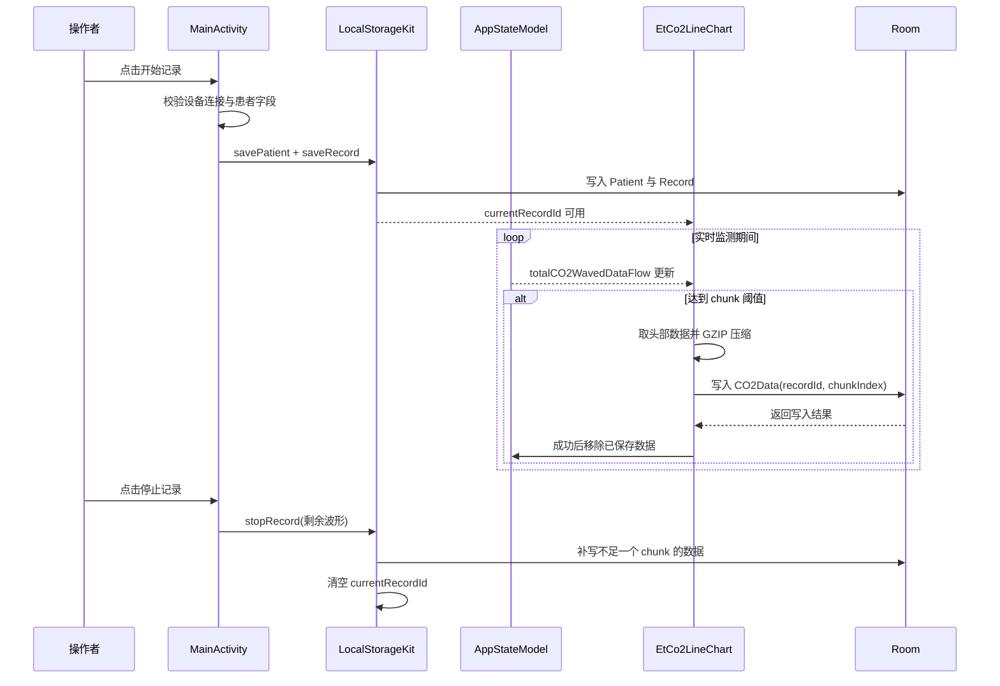

# CapnoEasy 五分钟图解导览

阅读时间：约 5 分钟适合：新成员、评审人、交付人员证据：当前分支源码

!!! abstract "先建立共同认识"
    CapnoEasy 的 Android 和 iOS 都连接二氧化碳监测设备，但两端不共享一套应用架构。Android 当前使用 Room 持久化记录，并支持历史、PDF、热敏打印和数据库备份；iOS 当前以内存波形生成 PDF。共享的是设备协议和业务语义，不是实现结构。

## 一张图看懂产品边界

<figure class="wiki-diagram wiki-diagram--wide" markdown>

<figcaption><strong>文字摘要：</strong>两端都能连接设备并呈现实时数据；Android 的记录与输出经过 Room，iOS 当前经过内存波形生成 PDF，两条路径不得合并描述。</figcaption>
</figure>

## 一次完整业务旅程

<figure class="wiki-diagram wiki-diagram--wide" markdown>

<figcaption><strong>文字摘要：</strong>两端在实时监测后分叉：Android 进入持久化历史与多输出链路，iOS 当前进入内存波形与 PDF 链路。</figcaption>
</figure>

## 实时数据如何到达屏幕

<figure class="wiki-diagram wiki-diagram--wide" markdown>

<figcaption><strong>文字摘要：</strong>Android 和 iOS 分别通过自己的 BLE、状态和 UI 链路到达屏幕；需要一致的是协议解析结果，不是类或分层形态。</figcaption>
</figure>

## 一次记录如何落到本地

<figure class="wiki-diagram wiki-diagram--wide" markdown>

<figcaption><strong>文字摘要：</strong>Android 创建记录后按阈值写入 chunk，停止时补写余量；`Record.endTime` 的停止更新仍是 P0 待确认项。</figcaption>
</figure>

## 接下来读什么

产品、临床业务、交付

先从[行业与业务背景](../business/industry-background.md)理解二氧化碳描记、典型场景和技术路线，再进入[应用业务与端到端流程](../business/domain-and-workflows.md)查看 CapnoEasy 的参与者、报警责任链和数据不变量。

Android 架构

从 [Android 架构](../architecture/android-architecture.md) 阅读 Activity/Compose、全局状态、BLE Kit、Room 和输出链路。

iOS 架构

从 [iOS 架构](../architecture/ios-architecture.md) 阅读 SwiftUI、EnvironmentObject、CoreBluetooth、内存历史和 PDF 链路。

