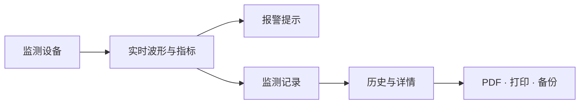
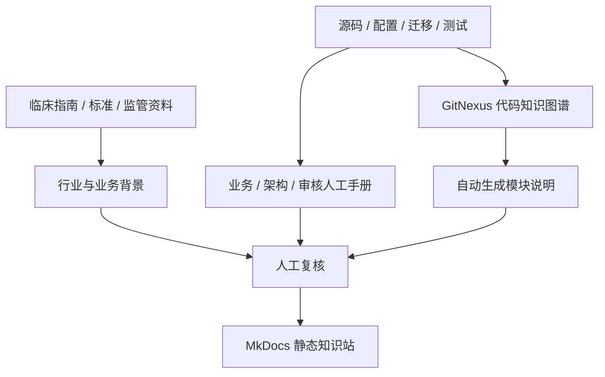

CAPNOEASY KNOWLEDGE BASE

# 把设备、数据和交付讲清楚

CapnoEasy 项目知识库把业务语义、双平台架构、审核门禁和代码图谱连成一条可追溯的知识链。第一次进入建议先看图解导览；准备改代码或发版本时，直接进入对应手册。

[五分钟图解导览](guide/visual-overview.md){ .md-button .md-button--primary }
[查看发布门禁](review/review-guide.md#release-gate-flow){ .md-button }

当前证据基线
<strong>当前分支源码</strong>

已审核知识域
<strong>业务 · 架构 · 审核</strong>

本轮页面复核
<strong>2026-07-19</strong>

!!! warning "证据优先级"
    当前源码、配置、数据库迁移和测试是应用行为的第一证据源。行业知识使用权威指南、标准和监管资料，并与产品预期用途分开；`代码模块参考`用于导航和理解代码，但不能替代源码核验。

## 按任务选择入口

第一次来 · 约 5 分钟

**[先看图解导览](guide/visual-overview.md)**

用产品边界图、业务流程图、实时数据时序和记录持久化时序，快速建立对 CapnoEasy 的整体认识。

行业 · 临床背景 · 产品边界

**[行业与业务背景](business/industry-background.md)**

二氧化碳描记、核心参数、典型场景、主流/旁流技术和标准监管视角。

CapnoEasy · 用户 · 应用流程

**[应用业务与端到端流程](business/domain-and-workflows.md)**

围绕当前应用介绍参与者、连接、监测、报警、记录、报告和数据边界。

Android · iOS · 架构

**[架构总览与数据契约](architecture/technical-architecture.md)**

双平台框架与跨平台契约；BLE、持久化和输出分别进入专题页。

评审 · 测试 · 质量 · 发布

**[审核总览与发布门禁](review/review-guide.md)**

风险分级、当前阻断项，以及清单、故障、隐私和发布证据专题入口。

文档 · 自动化

**[文档生成与维护](contributing.md)**

MkDocs 构建、代码模块参考同步和内容所有权。

## 从业务动作到交付结果

<figure class="wiki-diagram" markdown>

<figcaption><strong>文字摘要：</strong>设备数据先形成实时状态和报警，记录后进入历史，并从同一记录快照生成 PDF、打印与备份。</figcaption>
</figure>

## 知识如何形成

<figure class="wiki-diagram" markdown>

<figcaption><strong>文字摘要：</strong>行业背景来自外部权威资料，应用行为来自当前代码证据；人工手册和代码图谱经复核后由 MkDocs 汇总，两类证据不能互相替代。</figcaption>
</figure>

### 人工维护区

- `docs/business/`：领域术语、业务对象和端到端流程；
- `docs/architecture/`：技术框架、平台边界和数据契约；
- `docs/review/`：代码、测试、隐私和发布审核知识。

这些页面受 Git 管理，不允许自动生成脚本覆盖。

### 自动生成区

`docs/generated/gitnexus/` 来自本地 `.gitnexus/wiki/`，由 `scripts/sync_gitnexus_wiki.py` 同步。页面带有生成提交和时间元数据；重新生成后必须复核事实和链接。

## 当前重点风险

!!! danger "发布与合并前优先处理"
    当前基线包含 **2 项 P0 阻断**和 **5 项 P1 高风险**。详细证据、关闭条件和最低测试组合见[审核与评审指南](review/review-guide.md#baseline-findings)。

- Android EtCO₂/RR 报警区间判断需要业务规则和边界测试确认；
- 停止记录时的 `Record.endTime` 更新链路需要确认；
- 实时波形 chunk 当前使用带临时标记的 100 点参数；
- Room v2 schema、迁移和备份恢复测试仍需补齐；
- 患者数据、敏感权限和诊断上报需要持续做最小化审核。
