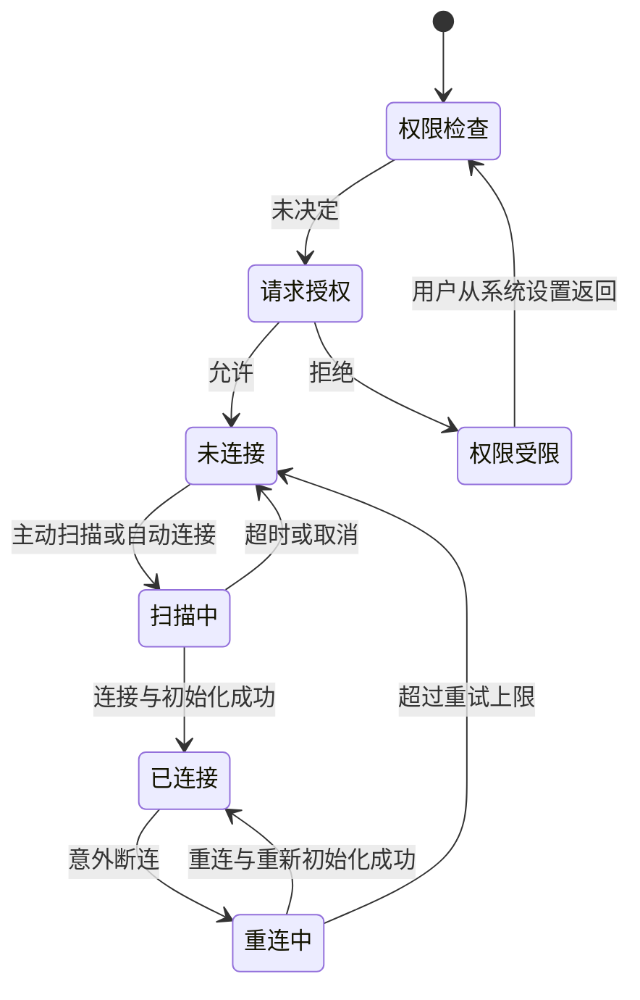
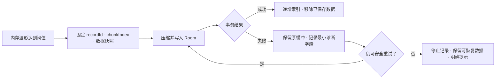
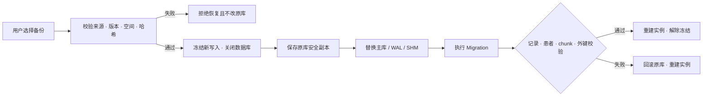

# CapnoEasy 故障路径与恢复

异常路径故障注入可恢复状态

!!! warning "图的性质"
    本页给出审核目标状态，不把尚未由测试证明的恢复行为写成“当前已实现”。每条路径都应由真机、回放或故障注入证据关闭。

## BLE 权限、断连与重连

<figure class="wiki-diagram wiki-diagram--wide" markdown>

<figcaption><strong>文字摘要：</strong>拒绝权限必须停止扫描并给出设置入口；断连后不能继续显示陈旧“已连接”状态，重连必须有限次且重新初始化。</figcaption>
</figure>

审核证据：权限拒绝录像、系统设置返回、扫描超时、监测中断电、重连后参数回读、重试上限与报警声音状态。

## chunk 写入失败

<figure class="wiki-diagram wiki-diagram--wide" markdown>

<figcaption><strong>文字摘要：</strong>数据库成功提交是移除内存波形的唯一前提；失败要保留原数据并避免重复 chunk。</figcaption>
</figure>

审核证据：磁盘不足、数据库异常、压缩异常、重复重试、应用后台与停止记录并发；验证 `recordId + chunkIndex` 唯一且无丢点。

## 备份、恢复与迁移失败

<figure class="wiki-diagram wiki-diagram--wide" markdown>

<figcaption><strong>文字摘要：</strong>恢复必须先冻结写入并保留原库副本；替换、迁移或校验失败时都回滚，不能留下半迁移状态。</figcaption>
</figure>

审核证据：上一发布版本真实数据库、损坏备份、版本过新、空间不足、恢复中断、WAL/SHM 一致性、回滚后的记录数量与 chunk 连续性。

## 最小验收矩阵

| 路径 | 必须观察的状态 | 必须证明的数据性质 |
|---|---|---|
| 权限拒绝 | 无扫描、无假连接、设置入口清晰 | 不产生患者或设备残留数据 |
| 断连重连 | 状态及时、重试有限、参数重新初始化 | 不把断连期间陈旧值写入新记录 |
| chunk 写失败 | 用户可知、可重试或安全停止 | 不丢点、不重复、不跨记录 |
| 恢复失败 | 原库可回滚、实例可重新打开 | 患者、记录、chunk 和外键一致 |

下一步回到[领域审核清单](domain-checklists.md)，把本页场景关联到实际测试编号。
