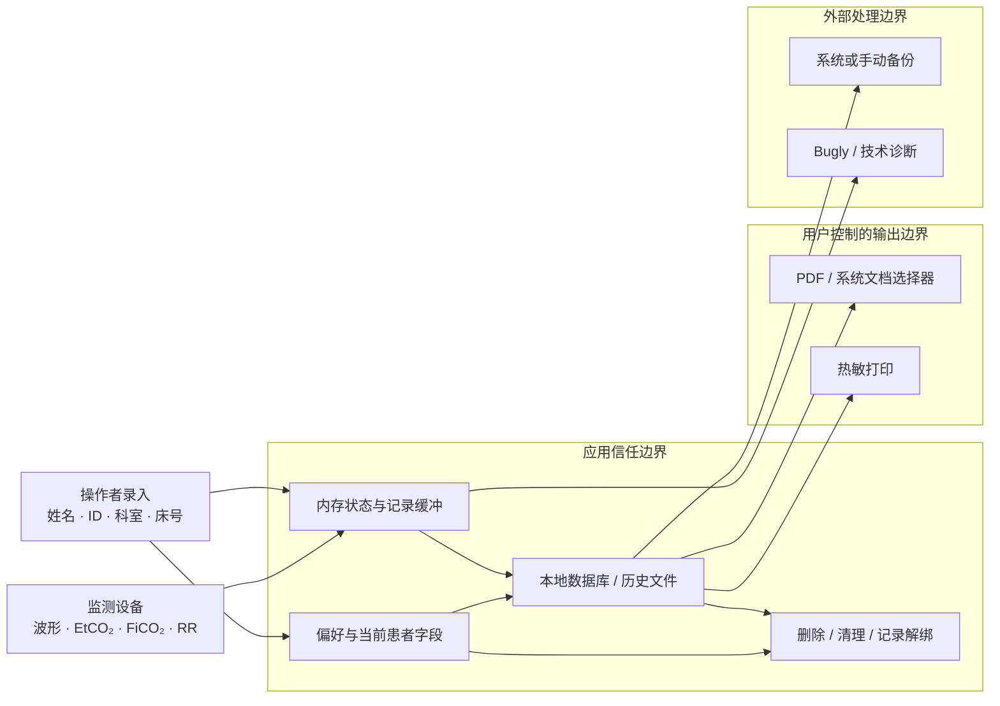

# CapnoEasy 患者数据生命周期

患者数据信任边界最小化与可删除

!!! danger "审核原则"
    患者身份、监测记录与报告属于同一高敏感数据链。工程实现必须证明采集必要、存储受控、导出由用户触发、诊断去标识、备份可追踪，并有明确的保留与删除策略。

## 生命周期与信任边界

<figure class="wiki-diagram wiki-diagram--wide" markdown>

<figcaption><strong>文字摘要：</strong>患者身份与监测数据在应用内形成记录；PDF、打印、备份和 Bugly 都跨越信任边界，必须分别控制授权、字段、保留期和删除。</figcaption>
</figure>

## 数据清单与控制要求

| 阶段 | 典型数据 | 主要位置 | 最低控制 |
|---|---|---|---|
| 采集 | 姓名、性别、年龄、住院号、科室、床号、设备数据 | UI、BLE 回调、内存状态 | 只采集批准流程需要的字段；输入校验；不写调试日志 |
| 本地存储 | Patient、Record、CO2Data、报告路径 | Room、iOS 历史、偏好 | 应用私有目录；记录归属和时间一致；访问最小化 |
| 导出与打印 | 患者字段、时间、数值、波形 | PDF、系统选择器、打印机 | 用户显式触发；同一记录快照；安全文件名；取消无残留 |
| 诊断 | 错误阶段、类型、计数、布尔状态 | 本地日志、Bugly | 禁止姓名、ID、科室、床号、完整文件名和原始波形 |
| 备份与恢复 | 数据库、WAL/SHM、历史 | 系统备份、用户选择位置 | 明确范围、加密/访问控制、版本校验、失败回滚 |
| 保留与删除 | 患者、记录、导出副本、偏好 | 应用与用户控制位置 | 明确保留期；级联/解绑正确；删除后不再出现在历史或默认输入 |

## 当前需要关闭的控制缺口

1. `MANAGE_EXTERNAL_STORAGE` 与后台位置权限需要逐项证明必要性，并优先收敛到系统选择器和应用私有目录；
2. `allowBackup` 与备份规则需要确认实际包含哪些患者数据、恢复范围和删除后的残留行为；
3. `ErrorReporter.sanitizeValue` 只做格式清洗，不能替代个人信息识别；所有调用点需建立允许字段清单；
4. 患者字段会进入偏好、PDF 和文件名，需验证复用、清空、导出取消与多患者切换；
5. 当前 Wiki 未看到统一保留期和用户删除说明，需由产品、质量与隐私责任人补齐批准规则。

## 审核问题

- 谁是每类数据的业务所有者，谁批准新增字段？
- 数据是否能在不使用姓名/住院号的情况下完成诊断？
- 导出、打印和备份是否都由用户明确动作触发？
- 删除患者或记录后，偏好、文件路径、PDF、备份和诊断副本如何处理？
- Android 与 iOS 是否给出一致的患者数据边界和用户说明？
- 版本升级后，旧数据的保留、迁移和删除是否仍然可验证？

## 可点击代码证据

- [Android 权限与备份声明](https://github.com/weisiwu/Capnograph/blob/edfd024010878ede15ae0d16c58308adc8eebef7/apps/android/app/src/main/AndroidManifest.xml)
- [本地存储与数据库](https://github.com/weisiwu/Capnograph/blob/edfd024010878ede15ae0d16c58308adc8eebef7/apps/android/app/src/main/java/com/wldmedical/capnoeasy/kits/LocalStorageKit.kt)
- [PDF 生成](https://github.com/weisiwu/Capnograph/blob/edfd024010878ede15ae0d16c58308adc8eebef7/apps/android/app/src/main/java/com/wldmedical/capnoeasy/kits/PDFKit.kt)
- [Bugly 诊断封装](https://github.com/weisiwu/Capnograph/blob/edfd024010878ede15ae0d16c58308adc8eebef7/apps/android/app/src/main/java/com/wldmedical/capnoeasy/kits/ErrorReporter.kt)
