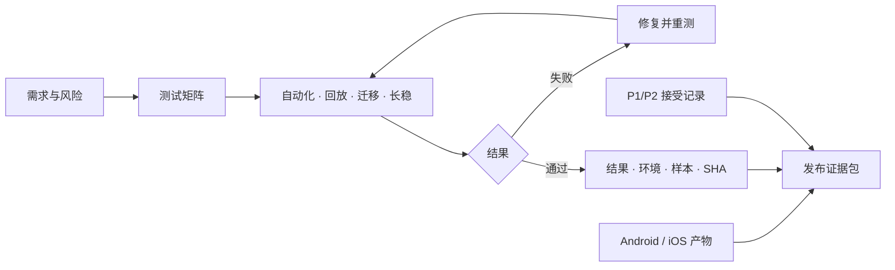

# CapnoEasy 测试与发布证据

发布候选版本证据优先可复现

## 最低自动化测试组合

| 层级 | 最低内容 | 关键失败样本 |
|---|---|---|
| 协议单测 | 校验和、每类 DPI/状态位、字节边界、缩放、无效帧 | 截断帧、错误校验、未知状态位 |
| 业务单测 | 报警五点边界、单位切换、记录状态机、患者输入约束 | 边界等值、重复点击、状态恢复 |
| 持久化测试 | chunk 唯一/排序/压缩往返、v1→v2 迁移、备份恢复 | 写入失败、损坏块、恢复中断 |
| UI/集成测试 | 权限拒绝、连接/断连、开始/停止、历史、导出取消 | 后台切换、Activity 重建、取消导出 |
| 回放测试 | 固定 BLE 帧序列在 Android/iOS 得到相同关键值 | 平台差异、设备状态切换 |
| 长稳测试 | 长时间记录、后台恢复、内存、数据库增长、PDF 分页 | 磁盘不足、进程终止、超长报告 |

## 证据从测试流向发布

<figure class="wiki-diagram wiki-diagram--wide" markdown>

<figcaption><strong>文字摘要：</strong>每份结果都要能追溯到需求、风险、环境、样本和提交；失败必须回到修复闭环。</figcaption>
</figure>

## 发布证据包 { #release-package }

一个可审核版本至少包含：

- 需求与风险项到测试用例的追踪表；
- 设备协议版本、样本帧和支持的固件范围；
- Android/iOS 构建日志、产物哈希、签名状态和提交 SHA；
- 数据库 schema diff、迁移与备份恢复结果；
- 报警边界、长记录、PDF/打印、跨平台回放结果；
- 权限与患者数据生命周期清单；
- 未关闭 P1/P2 的责任人、接受理由、补偿措施和计划版本。

## 产物追踪表

| 字段 | 要求 |
|---|---|
| 版本与 variant | Android versionName/versionCode；iOS version/build；debug/release |
| 源码 | 完整提交 SHA、分支、是否包含未提交改动 |
| 构建环境 | JDK、Gradle/AGP、Xcode/SDK、Docker 镜像摘要 |
| 设备范围 | 系统版本、设备型号、监测设备固件、打印机型号 |
| 完整性 | APK/IPA/报告样本的 SHA-256 与签名验证结果 |
| 结果 | 测试报告、失败清单、重试说明、批准人和日期 |

## 风险接受记录

P1/P2 例外不应只写“已知问题”。记录至少包括影响、触发条件、患者/操作者可见结果、临时控制措施、负责人、到期日期和计划版本。P0 不允许通过风险接受绕过发布门禁。

## 发布后留存

- 保留证据包、产物哈希、发布说明和回滚入口；
- 线上诊断只收集最小技术字段，不用患者身份补充可观测性；
- 发现协议、报警、记录或迁移偏差时，关联原发布证据并重新评估风险；
- 文档与代码不一致时，以当前源码和测试为准，同时建立文档同步项。
