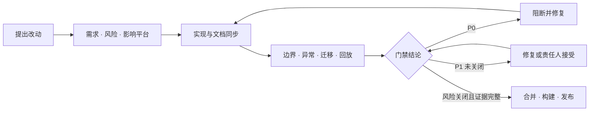

# CapnoEasy 审核总览与发布门禁

人工维护最近复核：2026-07-19基线：edfd024

--8<-- "docs_snippets/source-baseline.md"

!!! danger "当前发布门槛"
    当前基线列出 **2 项 P0 阻断**与 **5 项 P1 高风险**。它们是源码审查发现的待关闭项，不等同于已复现缺陷；在合并或发布前，应按本页关闭条件提交可复现证据。

P0 阻断<strong>2</strong><small>关闭前不得发布</small>

P1 高风险<strong>5</strong><small>原则上修复后合并</small>

证据原则<strong>可追踪</strong><small>需求、代码、测试和产物一致</small>

## 先按任务选择审阅路径

改代码前

**[领域审核清单](domain-checklists.md)**

按临床数值、BLE、记录、数据库、隐私、输出和跨平台逐项检查。

验证异常路径

**[故障路径与恢复](failure-paths.md)**

覆盖权限拒绝、断连重连、chunk 写入失败和恢复失败。

处理患者数据

**[患者数据生命周期](patient-data-lifecycle.md)**

检查采集、存储、导出、诊断、备份、保留与删除边界。

准备发版

**[测试与发布证据](release-evidence.md)**

核对最低测试组合、产物追踪与风险接受记录。

## 从改动到发布的门禁 { #release-gate-flow }

<figure class="wiki-diagram wiki-diagram--wide" markdown>

<figcaption><strong>文字摘要：</strong>审核从需求开始；P0 必须阻断，P1 必须修复或形成责任人接受记录，证据完整后才可发布。</figcaption>
</figure>

## 风险分级

| 等级 | 定义 | 默认处理 |
|---|---|---|
| P0 阻断 | 可能造成错误生命体征、漏报/误报、患者数据错配/丢失、无法升级或敏感数据泄露 | 不得合并或发布；修复并提交专项测试证据 |
| P1 高风险 | 可能导致连接、记录、报告、恢复失败，或跨平台语义漂移 | 原则上修复后合并；例外需责任人接受记录 |
| P2 一般 | 可维护性、性能、可观测性、文案或非关键体验问题 | 记录跟踪项、验证范围和计划版本 |

## 当前基线审核结论 { #baseline-findings }

| 等级 | 发现 | 可点击代码证据 | 关闭条件 |
|---|---|---|---|
| P0 | EtCO₂/RR 有效区间使用 `value <= start && value >= endInclusive` | [`BlueToothKit.handleCO2Waveform`](https://github.com/weisiwu/Capnograph/blob/edfd024010878ede15ae0d16c58308adc8eebef7/apps/android/app/src/main/java/com/wldmedical/capnoeasy/kits/BlueToothKit.kt) | 需求确认 + 五点边界单测 + 设备回放 |
| P0 | 停止记录未见 `Record.endTime` 更新 | [`MainActivity`](https://github.com/weisiwu/Capnograph/blob/edfd024010878ede15ae0d16c58308adc8eebef7/apps/android/app/src/main/java/com/wldmedical/capnoeasy/pages/MainActivity.kt) · [`LocalStorageKit`](https://github.com/weisiwu/Capnograph/blob/edfd024010878ede15ae0d16c58308adc8eebef7/apps/android/app/src/main/java/com/wldmedical/capnoeasy/kits/LocalStorageKit.kt) | 数据模型确认 + 时长/报告测试 |
| P1 | 波形 chunk 实际值为带 TODO 的 100 | [`LocalStorageKit.maxRecordDataChunkSize`](https://github.com/weisiwu/Capnograph/blob/edfd024010878ede15ae0d16c58308adc8eebef7/apps/android/app/src/main/java/com/wldmedical/capnoeasy/kits/LocalStorageKit.kt) | 生产参数决策 + 长记录压测 + 兼容说明 |
| P1 | Room version 2，但 `exportSchema=false` 且只有 v1 快照 | [`AppDatabase`](https://github.com/weisiwu/Capnograph/blob/edfd024010878ede15ae0d16c58308adc8eebef7/apps/android/app/src/main/java/com/wldmedical/capnoeasy/kits/LocalStorageKit.kt) | 导出 v2 schema + migration 自动化测试 |
| P1 | 申请后台位置和所有文件访问，且允许备份 | [`AndroidManifest.xml`](https://github.com/weisiwu/Capnograph/blob/edfd024010878ede15ae0d16c58308adc8eebef7/apps/android/app/src/main/AndroidManifest.xml) | 必要性说明 + 最小权限方案 + 数据流审查 |
| P1 | Bugly 元数据不识别个人信息 | [`ErrorReporter.sanitizeValue`](https://github.com/weisiwu/Capnograph/blob/edfd024010878ede15ae0d16c58308adc8eebef7/apps/android/app/src/main/java/com/wldmedical/capnoeasy/kits/ErrorReporter.kt) | 调用点审计 + 患者字段禁止清单 |
| P1 | Android/iOS 测试以模板骨架为主 | [Android Tests](https://github.com/weisiwu/Capnograph/tree/edfd024010878ede15ae0d16c58308adc8eebef7/apps/android) · [iOS Tests](https://github.com/weisiwu/Capnograph/tree/edfd024010878ede15ae0d16c58308adc8eebef7/apps/ios) | 协议、报警、记录、迁移、报告测试 |

## 一条发现怎样关闭

关闭必须同时具备五类信息：源码或配置证据、批准需求、风险等级、可执行关闭条件、复核结果。只写“已修复”或只提供一张正常路径截图都不算闭环。

1. 建立唯一发现编号并记录责任人；
2. 关联需求、协议版本和受影响平台；
3. 提交自动化、设备回放、迁移或长稳结果；
4. 记录失败样本、测试环境、产物 SHA 与结论；
5. 由质量或指定责任人复核后进入[发布证据包](release-evidence.md#release-package)。

## 合并前八项通用检查 { #merge-checklist }

- [ ] 需求、风险等级、影响平台和验收标准明确；
- [ ] GitNexus 影响分析覆盖被改符号的调用者和执行流；
- [ ] 配置、资源、多语言、数据模型和另一平台的契约影响已评估；
- [ ] 新旧数据、断连、权限拒绝、后台/恢复和异常路径已验证；
- [ ] 患者身份、设备标识或本机路径没有进入日志、Bugly、文件名或截图；
- [ ] 测试覆盖边界值，不只覆盖正常路径；
- [ ] `context/`、Wiki 与发布说明已同步；
- [ ] `detect_changes()` 只显示预期符号和流程。

!!! note "适用边界"
    本 Wiki 是工程审核依据，不是法规认证结论。临床参数、风险管理、可用性、网络安全与注册资料仍须对应责任人批准。
